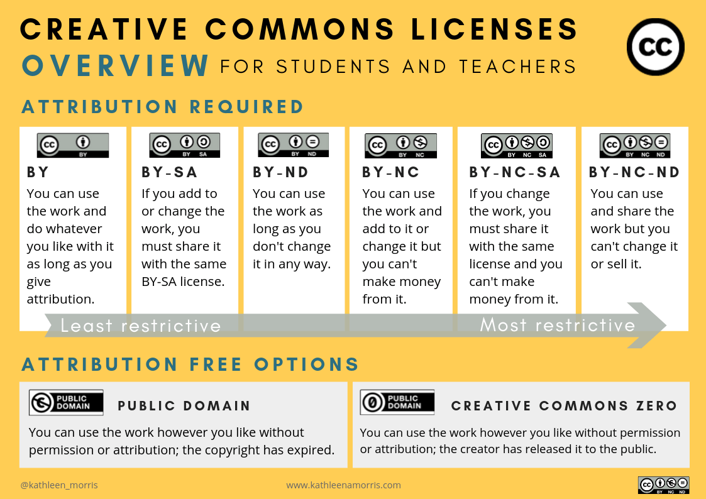
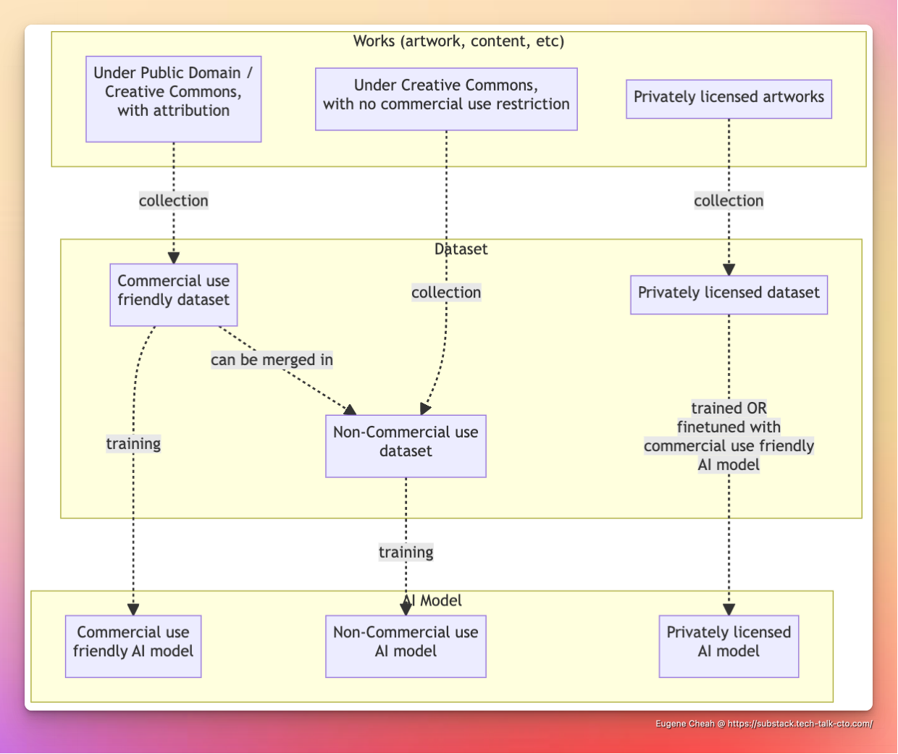
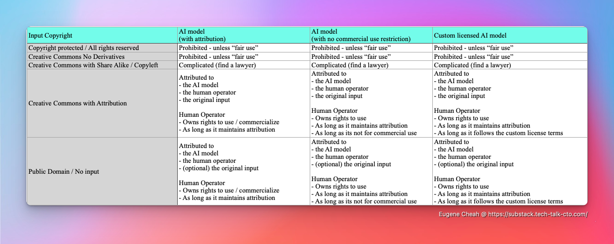

If we do not figure this out properly, depending on how the legal hammer swing on either side of the debate. The future of thousands of jobs lie in its wake.

So better we resolve it early now, then later, as the potential damage for it grows larger, with the increased usage of AI across all industries.

Also you will see the term "works" frequently, this refer in general to any content, which copyright can be assigned to. Including images, artworks, and written text. I will also be constantly refering to the user of the AI model, as "human operator" to avoid confusion with the "creator" of the AI models.

For most part, I will be referencing AI art generator, as they are in the hot seat for this debate within the public. However this proposal, extends to all AI models, including text based ones.

# A crash course on the AI copyright debate, and a disclaimer

To oversimplify, an extreamly complicated topic, that have multiple legal essays for each points on its own. The key take away, is that the current status is undecided, with lawyers and members of the public fighting with an agenda for either sides.

> One of the high profile case (which is not finalized) is how the "US Copyright Office" has been going back and forth on the copyright status of an AI generated comic ([link here](https://www.cbr.com/ai-comic-deemed-ineligible-copyright-protection/))

In essence the AI legal debate, boils down to 3 major questions.
- Is it permissible (maybe under fairuse), to use copyrighted materials to train an AI?
- Can AI generated works, be copyrighted? 
- If so, can an AI model be co-assigned copyright of an generated work (ie. artworks), together with its "human operator"?

In general these are the major arguments for AI.
- Proposition 1: AI learns and creates (words, music, art, etc) like a human
- Proposition 2: AI is just a tool

With the following 3 major opposition
- Opposition 1: Only "real" humans is eligible for copyright
- Opposition 2: Fair use is not automatic and is case by case
- Opposition 3: Lack of consent, from datasources used in dataset

While there are multiple additional proposition, and opposition point for both side, going around the public and the internet. They are excluded either because they are not significant compared to the key points here, or they are arguments regarding ethics, and not legal. 

> A notable argument that was left out: is the "for progress" proposition. On how AI should be allowed to learn from copyright materials to encourage progress of society, and that resisting such progress is harmful for society. This is an argument based on ethical and societal consideration, and not existing legal code.
> 
> As I am skimming the details of the debate, if you want a more in depth read, you can considers [theverge article : The scary truth about AI copyright is nobody knows what will happen next](https://www.theverge.com/23444685/generative-ai-copyright-infringement-legal-fair-use-training-data)

Finally, to state the obvious, I am not your lawyer, the following is not legal advice. 
Also copyright laws differ drastically from country to country (Japan for example, do not fully recognize fairuse).

Now with all of that, out of the way ...

---

# A proposal to classify AI generated content, and AI models as derivative work with  attribution *
> * with various limitations depending on the process used in each step

More specifically in the following sequence
- Dataset as a collection of work, from its individual data sources *
- AI Model as derivative work, from the dataset, together with the AI model creator
	- If an AI model is used to train another AI model (instead of a dataset), its classified as a derivitive of the base model, its training data, and its trainer model.
- AI Output as derivative work, from the AI modle, together with the "human operator" who provided a "prompt/instruction" *

This allow us to divide the copyright problem into distinctive steps. While relying on existing legal framework and case laws. Especially the legal framework revolving "Collaborative authorship" of opensource code.

In this framework, it would also allow to answer the 3 questions distinctively.

- Is it permissible, under fairuse, to use copyrighted materials to train an AI?
	- No, by default, unless it allows derivative work *
- Can generated works, be copyrighted? 
	- Yes *
- If so, can an AI model be co-assigned copyright of an generated work (ie. artworks), together with its human author (user of the AI)?
	- Kind of. It would be attributed *

This proposal also avoids being stuck in the debate if an AI perform the creation of work "like a living being".

This would also help create a clear path for all parties involved in a fair way.
- For artist
	- It gives them control over their own unique brand name, and art style, allowing them to commercialize it where possible
	- It does not stop AI from being used to generate artwork in known older artstyles
- For AI Model Creators
	- It provides a legal framework for them to create and commercialize AI models safely
- For Human Operators
	- It allows them to generate AI artworks
	- It allows them to potentially commercialize such artworks for their own personal or commercial uses.

## Understanding permissive license (usually with attribution clause)

One major factor that was constantly lost in debate, is how copyright is not binary. And how permissive licenses sit between full restrictive copyright, and no copyright.

This proposal, intends to take into account how permissive license is treated in the process, and intends to use such licenses, as a means to navigate the legal debate. 

Because, permissive license, have been a hallmark in opensource copyright movement for software coding, (eg. MIT license), this will help lay the groundwork for the proposed approach on existing case laws. (The list of opensource licenses can be found [here](https://opensource.org/licenses))

Outside of the software industry, the creative commons, would be its most prominent varient, with over [2 billion works](https://creativecommons.org/2021/05/24/were-turning-20-whats-happened-since-2001/) tracked in circulation.

Broadly speaking there would be 3 major categories

### 1. Content that cannot be used: Share Alike, and No-Derivatives
- No Derivatives, is as obvious as it gets, No-Derivatives
	- Creative Commons `BY-ND` and `BY-NC-ND`
- Share Alike, or CopyLeft licenses, require the existing license to be copied over into the license of the derivative work. While technically, this is possible within smaller focused datasets, for practical purposes this should be avoided due to the logicalchallenge when merging multiple "CopyLeft" licenses.
	- Creative Commons `BY-SA` and `BY-NC-SA` , for software code, an example would be the `GPL/AGPL/LGPL` licenses.

Its worth reminding the techbros, that no consent (to make derivatives), means no consent.

### 2. Content that can be used: Typically with attribution
- Derivative and distribution, is allowed with attribution
	- Creative Commons `BY`, for software an example would be the `MIT` license
- Derivative and distribution, is allowed even without attribution
	- Works in Public Domain, or licensed under Creative Commons Zero

### 3. Content that can be used: For non commerical use cases
- A common varient, which includes attribution, would be to limit the derivative work and distribution to non commerical use. This topic will be expended on in the dataset segment.
	- Creative Commons `BY-NC`

> Placing an early prediction, there will be derivative of Creative Commons license which specifically prohibits the usage with a dataset, or AI training. 
> 
> Maybe `BY-NADD` (No AI nor dataset derivatives)

---

### Note: Limitations NEEDS to be carried forward

Permissive licenses are typically written in a way, which enforces derivative works, and any collections including their work, or its distribution. To have the same limitation (Attribution, Non Commerical requirements).

As such measures are required to ensure the same limitations applied to the dataset, the AI model, and their generated content*.

Failure to do so, would break the current proposal, due to potential loopholes involved in Commercial companies, funding the creation of public dataset. Which is the case for stable diffusion as of now. In which public research may end up being used to "wash" copyright via "fairuse" for private commercial AI products.

For example
- [LAION.AI](https://laion.ai/) - was comissioned to build and opensource "Non Commercial" dataset
- [Stability.ai](https://stability.ai/) - built an AI model, based on LAION.AI dataset, without the "Non Commercial" restriction, and released it to the public
- Dreambooth.ai, and countless of other commercial AI art generators - used the model to build their paid commercial AI art generator.

The end result, is despite starting out in a way that "does not create a competing product", due to its open source nature, it ends up as a tool, [being used in commercial settings to replace artist, who had their images contributed to the dataset.](https://edition.cnn.com/2022/10/21/tech/artists-ai-images/index.html).

---

## How does it work in practise? - when making AI models

By classifying, downstream dataset, and AI models. As a derivative work of their upstream content. 

This allows copyright to be properly resepected across a chain. Similar to how open source projects work in the software industry. All while allowing existing laws work on each layer.

- Dataset layer
	- Will be based on existing webscrapping laws 
- AI Model layer
	- Because the final AI Model can be treated as "Code" (it literally can be exported as code). We can let existing opensource laws handle it from here
	- A clear legal path, will clear the way for commercial adoption
- AI Output layer
	- If we treat the AI model, as just code, with the licensing restriction that forces attribution to its output. It falls into place, with several existing code licensing models.

And where in all cases, attribution needs to be maintained, up the chain.

For example all AI models, would need to attribute their datasets, which would then in turn, be required to provide attribution for their sources.

Once this is established, in general there will be 3 major types of AI models
- Commercial use friendly AI models, which can be used in commercial settings.
	- For simplicity, this should be Creative Commons `BY`, or some thing simpliar
- Non-Commercial use AI models, which inherited the various "No commercial use" restriction from the original data. 
	- For simplicity, this should be Creative Commons `BY-NC`, or some thing simpliar
- Privately licensed AI models, which will typically be based on "Commercial use friendly AI model", finetuned for specific licensed use cases.

For right holders (ie. artist), who do not want any of their works to be used to train an AI model, or to be used by others as derivative work. They decide and stay in control, via the licensing terms.

For rights holders, who do allow derivative works, they get to decide if its retricted to non commercial uses.

Finally for right holders, especially those with very unique style, can sub-license their data, or AI model, and set their own terms of use. Typically as a way to commercialize their unique style.

## How does it work in practise? - when using AI models

Usign the AI model is where it gets more nuanced. Depending on if the AI is adding IP value, or not.

There are 2 major category which needs to be outlined.

### AI as an IP generator

The general rule of thumb, is that the output would be the derivative of all 3 participants, the AI model, the human operator (via a prompt typically), and the input material (if any, for example editing redrawing an existing image).

This is because the final output, would literally be a derivative of all 3 inputs.

If any of the 3 enforces a copyright clause (ie attribution, no commercial use), so will the derivative output. If the AI model following the Creative Commons model. Assuming the "Human Operator" has full rights to the input, the "Human Operator" would have full rights to the output, with the attribution clause limitation (and the no-commercial clause for no-commercial use AI).

If its just the "Human Operator" and the AI, the above structure still applies.

### AI as a reduction tool

This is currently limited to AI text model, where the AI is used in a way that does not add IP value. For example in "Short Summarization, Labeling, or Factual Extraction".

In this case, if the output has no additional content added, and is simply the reduction of the input, in accordence to the user instructions. And was dones so in a way that is clearly mapped to the instruction - The AI has arguably not "added any IP or context".

As such, in this case, the AI model should be treated as if it was a tool / extension of the human operator. And the output copyright, should be as if, the "Human Operator" performed the said instructions manually.

---

# Will this stop AI from taking artist jobs?

Quite frankly, no.

If the artist primary job was comissioned to render artwork in a commonly known style, that is out of copyright (eg. Vincent van Gogh style), or is very common in the public domain.

However, if the artist were to make or remix a newer style, that is unique and distinctive to them. 

Then Yes.

This prevents their new style or likeness, from being copied. And allows them to commercialize and be rewarded for their style on their own terms. Until with time, like all artworks - it enter public domain.

Ultimately, allow them to make a name and career for themselves, for their own unique style. (Without being ripped off mid way in the process)

---

# Alright, whats next?

As I am also neither a professional artist, or lawyer, nor politician.  All of this, may just end up being a programmer screaming into the crowd.

However if this approach make sense to you, especially if you are an artist, do feedback, forward it to as many legal friends, and start organizing a movement towards this.

For any lawyers who wish to refine this to a legal paper, please do so, and reach out to me, and provide credit.

At the end of the day, I do wish that we all steer into a direction where, both AI, and artist, can work together hand in hand. Either with whats proposed, or any other alternative proposal that respect both sides.
