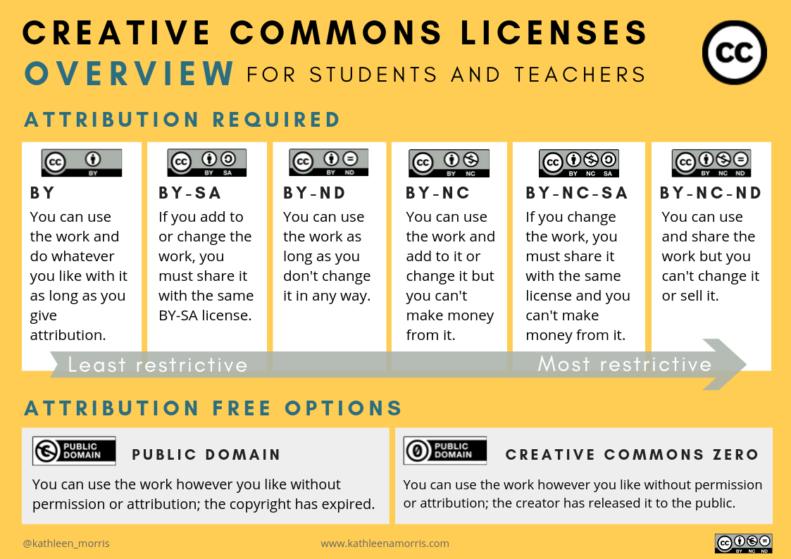

If we do not figure this out properly, depending on how the legal hammer swing on either side of the debate. The future of thousands of jobs lie in its wake.

So better we resolve it early now, then later, as the potential damage for it grows larger, with the increased usage of AI across all industries.

Also you will see the term "works" frequently, this refer in general to any content, which copyright can be assigned to. Including images, artworks, and written text. I will also be constantly refering to the user of the AI model, as "human operator" to avoid confusion with the "creator" of the AI models.

For most part, I will be referencing AI art generator, as they are in the hot seat for this debate within the public. However this proposal, extends to all AI models, including text based ones.

> I will also be adding smaller notes, citations to existing legal cases, and references in quote blocks, for most  non legal nerds, you can just skip over them for brievity.

# A crash course on the AI copyright debate, and a disclaimer

To oversimplify, an extreamly complicated topic, that have multiple legal essays for each points on its own. The key take away, is that the current status is undecided, with lawyers and members of the public fighting with an agenda for either sides.

> One of the high profile case (which is not finalized) is how the "US Copyright Office" has been going back and forth on the copyright status of an AI generated comic ([link here](https://www.cbr.com/ai-comic-deemed-ineligible-copyright-protection/))

In essence the AI legal debate, boils down to 3 major questions.
- Is it permissible (maybe under fairuse), to use copyrighted materials to train an AI?
- Can AI generated works, be copyrighted? 
- If so, can an AI model be co-assigned copyright of an generated work (ie. artworks), together with its "human operator"?

In general these are the major arguments for AI.
- Proposition 1: AI learns and creates (words, music, art, etc) like a human
- Proposition 2: AI is just a tool

With the following 3 major opposition
- Opposition 1: Only "real" humans is eligible for copyright
- Opposition 2: Fair use is not automatic and is case by case
- Opposition 3: Lack of consent, from datasources used in dataset

While there are multiple additional proposition, and opposition point for both side, going around the public and the internet. They are excluded either because they are not significant compared to the key points here, or they are arguments regarding ethics, and not legal. 

> A notable argument that was left out: is the "for progress" proposition. On how AI should be allowed to learn from copyright materials to encourage progress of society, and that resisting such progress is harmful for society. This is an argument based on ethical and societal consideration, and not existing legal code.
> 
> As I am skimming the details of the debate, if you want a more in depth read, you can considers [theverge article : The scary truth about AI copyright is nobody knows what will happen next](https://www.theverge.com/23444685/generative-ai-copyright-infringement-legal-fair-use-training-data)

Finally, to state the obvious, I am not your lawyer, the following is not legal advice. 
Also copyright laws differ drastically from country to country (Japan for example, do not fully recognize fairuse).

Now with all of that, out of the way ...

---

# A proposal to classify AI generated content, and AI models as derivative work with  attribution *
> * with various limitations depending on the process used in each step

More specifically in the following sequence
- Dataset as a collection of work, from its individual data sources *
- AI Model as derivative work, from the dataset, together with the AI model creator
- AI Output as derivative work, from the AI modle, together with the "human operator" who provided a "prompt/instruction" *

This allow us to divide the copyright problem into distinctive steps. While relying on existing legal framework and case laws. Especially the legal framework revolving "Collaborative authorship" of opensource code.

This proposal also avoids being stuck in the debate if an AI perform the creation of work "like a living being".

This would also help create a clear path for AI models to be created and used in a fair way for both the original copyright owners, the AI model creators, and its user. Allowing both the industrial progress of AI, and the protection of existing right-holders. All while avoiding needing to "create new licensing and legal frameworks"

In this framework, it would also allow to answer the 3 questions distinctively.

- Is it permissible, under fairuse, to use copyrighted materials to train an AI?
	- No, by default, unless it allows derivative work *
- Can generated works, be copyrighted? 
	- Yes *
- If so, can an AI model be co-assigned copyright of an generated work (ie. artworks), together with its human author (user of the AI)?
	- No, not exactly. But it would be attributed *

## Understanding permissive license (usually with attribution clause)

One major factor that was constantly lost in debate, is how copyright is not binary. And how permissive licenses sit between full restrictive copyright, and no copyright.

This proposal, intends to take into account how permissive license is treated in the process, and intends to use such licenses, as a means to navigate the legal debat. 

Additionally, permissive license, have been a hallmark in opensource copyright movement for software coding, (eg. MIT license), which will help lay the groundwork for the proposed approach on existing case laws. (The list of opensource licenses can be found [here](https://opensource.org/licenses))

Outside of the software industry, the creative commons, would be its most prominent varient, with over [2 billion works](https://creativecommons.org/2021/05/24/were-turning-20-whats-happened-since-2001/) tracked in circulation.

Broadly speaking there would be 3 major categories

### 1. Content that cannot be used: Share Alike, and No-Derivatives
- No Derivatives, is as obvious as it gets, No-Derivatives
	- Creative Commons `BY-ND` and `BY-NC-ND`
- Share Alike, or CopyLeft licenses, require the existing license to be copied over into the license of the derivative work. While technically, this is possible within smaller focused datasets, for practical purposes this should be avoided due to the logicalchallenge when merging multiple "CopyLeft" licenses.
	- Creative Commons `BY-SA` and `BY-NC-SA` , for software code, an example would be the `GPL/AGPL/LGPL` licenses.

Its worth reminding the techbros, that no consent (to make derivatives), means no consent.

### 2. Content that can be used: Typically with attribution
- Derivative and distribution, is allowed with attribution
	- Creative Commons `BY`, for software an example would be the `MIT` license
- Derivative and distribution, is allowed even without attribution
	- Works in Public Domain, or licensed under Creative Commons Zero

### 3. Content that can be used: For non commerical use cases
- A common varient, which includes attribution, would be to limit the derivative work and distribution to non commerical use. This topic will be expended on in the dataset segment.
	- Creative Commons `BY-NC`

> Placing an early prediction, there will be derivative of Creative Commons license which specifically prohibits the usage with a dataset, or AI training. 
> 
> Maybe `BY-NADD` (No AI nor dataset derivatives)

---

### Note 1: Permissive licenses with Derivative Rights, typically includes distribution rights 

This is notable, as it will mitigate potential legal issues, when a derivative work is deemed "not substentially" different from the original on any step of the process. And the AI ability, to create very close replicas, when given the right prompt, and seed.

Avoiding a complication, if lets say the input artwork which was used, and the final AI output was not changed substentially.

> Is this AI copy of the mona lisa generated by stable diffusion AI, considered a substential derivative work? Either way, im glad that the mona lisa is public domain, so I do not need to test this question in court.

> This potential issues caused by the seperation of "distribution rights" from "derivitive rights". Was raised and outlined in a paper regarding "AI derivatives" (the only paper i can find considering AI and derivatives).
> 
> This would be similar to ['_Lee v. A.R.T. Co._, (or the _Annie Lee_ case)'](https://law.justia.com/cases/federal/district-courts/FSupp/173/625/1377766/). Where the court held that the created work (reselling an existing artwork, onto tiles) was not original and creative enough to rise to the level of creating a derivative work.
> 
> In the AI case, substential change, to ensure proper qualification under derivative work could only be decided after the creation of the final AI art piece. Making the output a potential legal liability, if its proven otherwise.
> 
> By ensuring both distribution rights, and derivatives rights is bundled together, this avoids this legal liability. Ensuring that the final work has sufficent rights for the "human operator" desired use cases.
> 
> Applicable in the above example, if lets say instead of the "Mona Lisa" i had the AI recreate a known copyrighted artwork.

---
Citations
- AI Derivatives: the Application to the Derivative Work Right to Literary and Artistic Productions of AI Machines - https://papers.ssrn.com/sol3/papers.cfm?abstract_id=4022665
- _Lee v. A.R.T. Co._, [125 F.3d 580](https://scholar.google.com/scholar_case?case=7811317241368435030) (7th Cir. 1997).
---

## Step 1 - for a legal AI: Preparing the dataset

> Thankfully, there existing caselaw around this step, regarding webscrapping (a common way to create this dataset), most notably [_HiQ Labs v. LinkedIn_](https://en.wikipedia.org/wiki/HiQ_Labs_v._LinkedIn) and the [EU DSM](https://eur-lex.europa.eu/legal-content/EN/TXT/HTML/?uri=CELEX:32019L0790&from=EN) directive on text and data mining

In summary
- Scrapping of publiclly accessible data is permitted
	- Within resonable limits, that does not harm the site owners (aka do it slowly, no DDOS)
	- With robots.txt being respected
- Scrapping of personal information is prohibited (and should be remove from the dataset)
	- This is due to GDPR, and CPRA privacy laws
- Scrapping of copyrighted materials is prohibited
	- This includes videos, images, music, literary text, and website code
	- Facts however are permitted. Which means ....
- Scrapping of facts extracted from the website is permitted
	- This is achieved by scanning a given website, followed by extracting and storing the facts.

In the context of AI art generation, this defaults to NO.
In the context of text based AI, this require the scrapping process to convert and extract out the the facts, and not simply use the full webscrape data directly.

While this sounds rather "useless" for an AI creator, its only a baseline.

---

### 1A) Creating a "commercial dataset" (with attribution)

These are dataset, which are permitted to be used for the creation of AI for "Commerical Use". 

This is done by building a dataset for all materials
- Under public domain
- Under Creative Commons `BY` license (or other similarly permissive license)
	- While keeping track of all atribution
- While avoiding content with "No Commerical" or "No Derivative" clause.

In addition, for text based dataset
- Extraction of key facts, from public webcrawls in a transformative way
	- Such extraction of key facts, can be done either by hand (humans) or through the use of AI ( more on this in step 3 )
	- For example, you cannot scrape entire newspaper articles on its own, but you can extract out the facts from the articles. And use those.
	- Facts here should be statement based, to avoid copying any "literal styles", point form single sentences work best here.

This can then be combined with existing dataset
- From licensed private and commercial datasets
- From public datasets (like wikipedia)

> Facts are not copyrightable: [copyright.gov](https://www.copyright.gov/help/faq/faq-protect.html#:~:text=Copyright%20does%20not%20protect%20facts,%22What%20Works%20Are%20Protected.%22)

---

### Note 2: Attributions should be tracked

A common criticism to this statement, is how it is "not practical". I would insist otherwise. 

The opensource and linux community, have been doing this for years. [With individual projects tracking over 19,000 contributors and authors.](https://octoverse.github.com/2018/projects.html) Most of this was done in an automated fashion.

And because most datasets are built with automation, there is no technical reason why this is not possible. Additionally, because of the automated nature that attribution should be tracked, it is recommended that all sources in a dataset be tracked (even if its in the public domain). As a means to proof and audit.

However due to the large scale of tracking involved, it is common for derivative works of such projects, to attribute credit to the base project and its contributors. Linking to the project, which would then link to the list of contributors.

For large scale opensource projects, this can end up consisting of several smaller list of contributors, and list of lists, to maintain them all.

---

### 1B) Creating a "Non Commercial" dataset (with attribution)

These are dataset, which are permitted to be used for the creation of AI for strinctly "Non-Commerical Use". AKA, research, or private and personal use.

Not only can it include Creative Commons `BY-NC` non commercial content.

The "Fair Use" and "Public Good" arguments are now in play for text based data with the following limitations. (Images, music, and videos are more complicated, go ask a real lawyer).
- it does not create a competing product, nor impede on the rights owner means to profit
- the original data is "transformed in a substential way"
- and "do not copy a substantial portion of the original work"

What this means, that beyond "facts in point form"
- Short abstracts are now permitted
- Long form summary (which is transformative) are now permitted.

Because fairuse is complicated on a country to country basis, talk to a lawyer.

---

### Note 3: Limitations NEEDS to be carried forward

Permissive licenses are typically written in a way, which enforces derivative works, and any collections including their work, or its distribution. To have the same limitation (Attribution, Non Commerical requirements).

As such measures are required to ensure the same limitations applied to the dataset, the AI model, and their generated content*.

Failure to do so, would break the current proposal, due to potential loopholes involved in Commercial companies, funding the creation of public dataset. Which is the case for stable diffusion as of now. In which public research may end up being used to "wash" copyright via "fairuse" for private commercial AI products.

For example
- [LAION.AI](https://laion.ai/) - was comissioned to build and opensource "Non Commercial" dataset
- [Stability.ai](https://stability.ai/) - built an AI model, based on LAION.AI dataset, without the "Non Commercial" restriction, and released it to the public
- Dreambooth.ai, and countless of other commercial AI art generators - used the model to build their paid commercial AI art generator.

The end result, is despite starting out in a way that "does not create a competing product", ends up with a tool, [being used in commercial settings to replace artist, who had their images contributed to the dataset.](https://edition.cnn.com/2022/10/21/tech/artists-ai-images/index.html)

