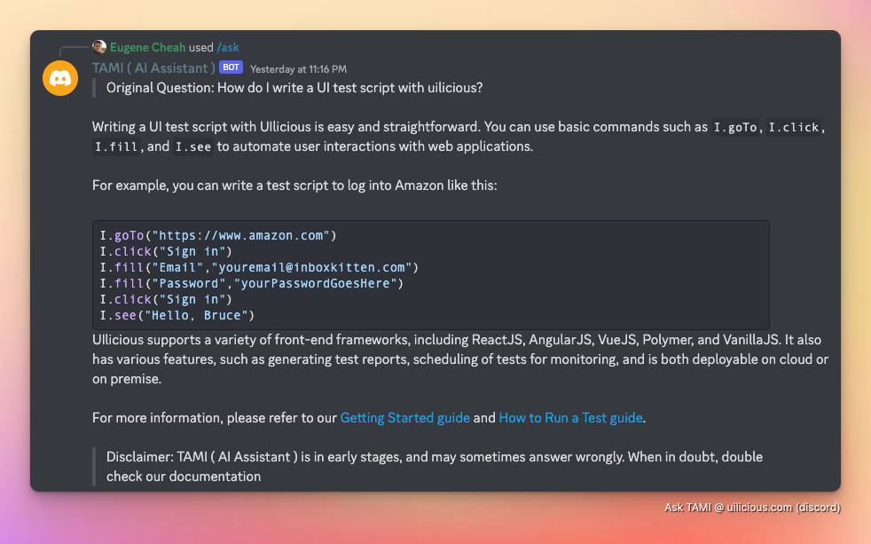
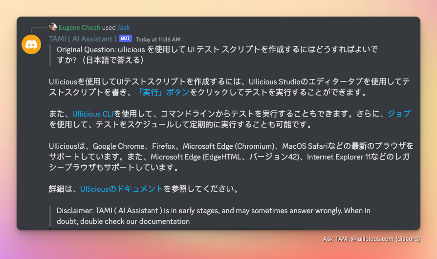

Recently at uilicious, we been experimenting around with various ways to better make use of AI both in our workflow and our users. And one of nearly unversal applicable use cases we found, was the use of AI to help answer common user (or staff members) questions.

For example on our discord, anyone can do a simple `/ask` for any question related to Uilicious, with the relevent answers found from our docs.



And is able to handle multiple languages, in limited capacity (eg. Japanese).



However this is alot more complicated then simply asking GPT3+ "the question".

Because, while ChatGPT, or the GPT3+ davinci model, may argubly be the first AI model to pass the turing test (but choose so to fail by admission). It has two major limitations.

1) It apperantly has limited knowledge on anything from 2021. Let alone the documentation changes involved in your latest startup in 2022, or beyond. Or any private internal documentation within a company.
2) It is way too willing to bluff out an answer, also known as hallucination. As the AI has been trained heavily to always provide an answer. Which is both potentially confusing for our users, and harmful when it misrepresents the company. (eg. claiming we can do things, that we cant)

> In an effort to make this guide, more "reselient" to future changes, we would be discussing the high level methods, and pointing to some existing tools which can be used. While avoiding any language or tool specific code examples.
> 
> Additionally, while there is large overlaps with OpenAI guide for ["Question and Answers with embeddings"](https://github.com/openai/openai-cookbook/blob/main/examples/Question_answering_using_embeddings.ipynb), we found while reimplementing it several gotcha's that is easily missed. Which is very worth documenting in this article.

# How do we feed GPT3+ new knowledge? How do we prevent it from bluffing?

If your documentation, that needs answering is short. One way we could do this is simply provide  it as part of the prompt. In the following format.

```
Context:
<documents to include>

Answer the question as truthfully as possible using the provided text above, and if the answer is not contained within the text above, say "NO_ANSWER"

Question: 
<question>

Answer:
```

This prompt format, is provided by OpenAI. And seems to be something the model has been trained to work with to reduce hallucination / bluffing. (Though it ain't perfect, more on that later)

More importantly, as GPT3+ models has a token limit of 4000 (~1500 words). There is a more obvious problem, what if the document exceed the token limit?

What if you have 10,000 pages worth of documentations? It is both incredibly expensive (>$100), and slow (hours) to ask the question across all 10,000 pages.

That is where embedding comes in.


# Combining embedding search, with prompt engineering

Once you have a working embedding search, instead of querying and iterating every page of the documentation. Instead you can use the embedding search to find the top X result.

And use that top X result, with the prompt once again.

```
Context:
<documents to include>

Answer the question as truthfully as possible using the provided text above, and if the answer is not contained within the text above, say "NO_ANSWER"

Question: 
<question>

Answer:
```

Until a result is found. Terminating with a failure condition when all X result is iterated.

# 


# The 4 stages of an answer bot

In general there are 4 major stages in building a flexible and growing answer bot.

1) Formatting and preprocessing the data for embedding
	- Documentation database
		- Extracting and cleaning up raw data
		- Compression via "Detailed Summary"
		- Breaking up, and handling of large documents
	- Answer database setup
	- (Optional) Generating of short summary (for embedding filtering)
2) Embedding search and filtering
	- Building the embedding database
	- (Optional) Filtering and choosing of embedding results
3) Answering question from embeddings
	- Looping through, the chosen embeddings
4) Growing the answer database
	- Ask hard questions, to find the gaps
	- Add to the answer database, those failed questions

Only stage 2 & 3 happens on runtime. 
Stage 1 & 4 is iterated on as part of the build process.

## Stage 1 - Formatting and preprocessing the data for embedding

While openAI embedding, can take nearly any document that fits within 8,000 tokens. We are unable to actually use a document of that size.

One of the limitation of 


However, while it does drastically reduce by over 90% the hallucinations, by forcing only answers to be done using the documents provided. It is not fool proof, so additional measures are required (covered later).
