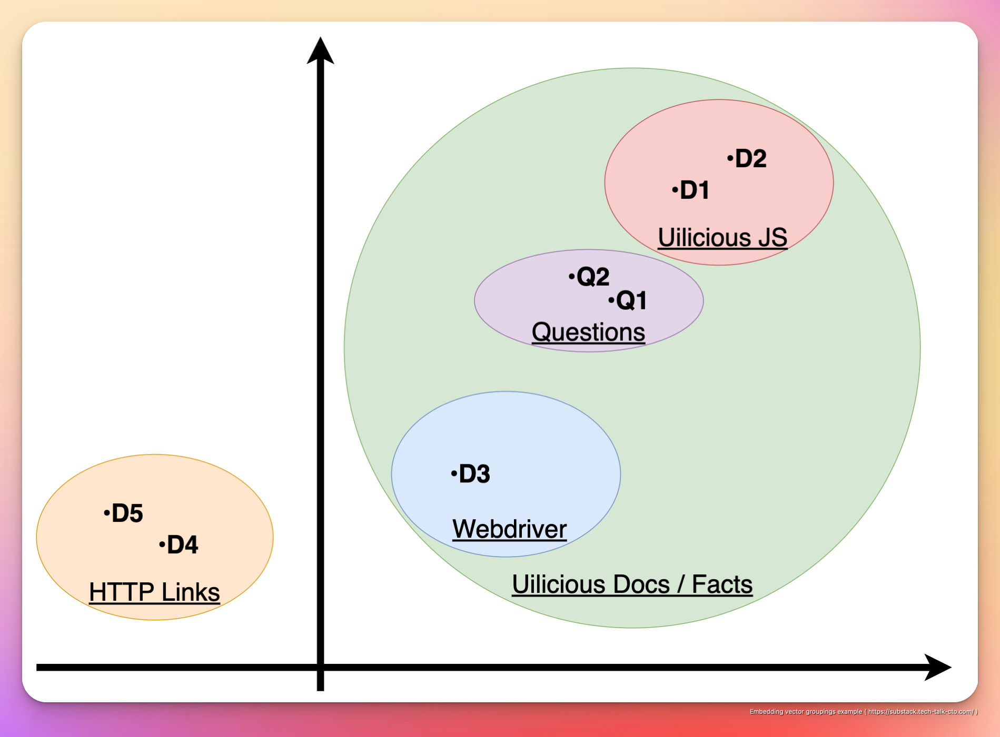
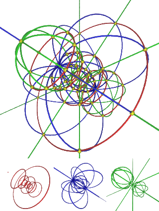

While GPT 3+ or ChatGPT, prompt engineering is easier to understand intutively. With many guides and examples avaliable on the web, and social media. Such as
- https://help.openai.com/en/articles/6654000-best-practices-for-prompt-engineering-with-openai-api
- https://github.com/f/awesome-chatgpt-prompts

Embeddings is less understood, due to various counter intutive behaviour on how it works. But, is an extreamly powerful tool for the purposes of search, or to be used together with existing text based models, for various other possible use cases...

Embeddings is arguably an equally powerful tool, within the AI toolkit, to instruction models. Due to its ability to handle search across different words and sentences, or even entire languages. Focusing on searching for the relevent document, for any query. 

For example, it can be used to power searching and answering from an english based documentation. In english ...


Or japanese ...


Or any other languages that the AI model supports ...

> Note that this article focuses on the search aspect, the answering process is in a follow up article.

# What is an embedding vector?

To generate an embedding vector, one will use an embedding AI model, converts any text (a large document, a sentence, or even a word), into an "N dimension array", called a vector. 

For example a sentence like
`How do I write a UI test script with Uilicious?` 

Can be converted into the following array (called a vector) via [OpenAI `text-embedding-ada-002` model](https://openai.com/blog/new-and-improved-embedding-model/): 
`[0.010046141, -0.009800113, 0.014761676, -0.022538893, ... an a 1000+ numbers]`

This vector represents the AI model summarized understanding on the text. Alternatively, you can think of this encoded "N dimension array", as an "N word summary" written in a language that only the AI can understand. 

Where related documents will have close distance with each other. Based on the AI understanding of the document (and not its text)

This is a major leap beyond simple keyword search of classic search engines. As it is able handle variations, in not just sentence structure, but possibly language all together (provided the AI model is trained to understand said language). 

Take the following as a hypothethical example, oversimplified inaccurately into 2 dimension space so that its easier for most people to understand:

| ID | Document Details | 2D (x,y) Vector |
|---|---|---|
| D1 | [Writing your first test on Uilicious](https://docs.uilicious.com/v3/getting-started/Writing-your-first-test.html) | [100, 90] |
| D2 | [List of uilicious UI testing commands](https://docs.uilicious.com/v3/reference/commands-list.html) | [110, 95] |
| D3 | [Connecting to uilicious webdriver grid](https://docs.uilicious.com/v3/how-to-guides/run-test/connect-to-webdriver-grid.html#) | [55, 62] |
| D4 | [Document with only a link to uilicious.com](http://uilicious.com/) | [-20, 30] |
| D5 | [Document with only a link to our discord](https://discord.gg/DZCmSRFwq8) | [-25, 32] |
| Q1 | How do I write a UI test script with uilicious? | [88, 80] |
| Q2 | (Q1 in japanese): uilicious を使用して UI テスト スクリプトを作成するにはどうすればよいですか?（日本語で答える）| [85, 81] |

Which can be visually presented as the following in 2D space.



For example D1,2,3 are all documents related on how to use Uilicious in various ways, and is grouped together within 55 to 110, and X,Y space.

D3, and D4, being simply links, and have no inherent value beyond that. Are grouped seperately within -110 to -125.

Furthermore, D1 & D2 is further grouped together, as they are about Uilicious testing commands, using our very own JavaScript based testing language. 

While D3, is grouped seperately, as its regarding using the webdriver protocall on our infrastructure directly, which intended for a different use case and audiences.

Similarly, for Q1 and Q2, despite the drastic differences in sentence structure and language. Because its essentially the same question. The 2 questions are grouped together. Additionally, while the question could technically be interprated both ways (Using uilicious test script, or webdriver protocall), because the question implies the usage of uilicious test scripting over webdriver. Its location is "closer" to D1 & D2, and further away from D3. 

As such despite having huge overlaps in keywords, these nuances in groupings are captured by the AI encoded within the embeddings.

In reality however, instead of an oversimplified 2 dimension array, which is easy for humans to understanding. An embedding can easily be a 1,000+ dimension array. 

> Another major limtation to note, is embedding vectors are unique to specific AI models. And cannot be mixed with one another.

## Math notes: N dimension math is not compatible with 2/3D math

While the oversimplified 2 dimension examples, is good for understanding the high level concept of grouping in relation to 1 question (or 1 point of view), it does not generalize well across multiple questions. Especially when they are not tightly related.

Due to complicated N dimension math. You can have situations, where A can be close to B, B can be close to C, but A and C can be considered far from each other. Which is an extreamly counter-intutive gotcha.

Such distances, are only useful when used relative to the same point, and the formular used. Which can be calculated either using
- **[Euclidean distance](https://en.wikipedia.org/wiki/Euclidean_distance):** aka Pythagorean Theorem on steroids
- **[Cosine Simlarity](https://en.wikipedia.org/wiki/Cosine_similarity):** complicated angular distance between 2 points
- **[Manhattan](https://en.wikipedia.org/wiki/Taxicab_geometry) or [Hamming](https://en.wikipedia.org/wiki/Hamming_distance) Distance:** Help, i need a math professor

> While the effectiveness of each formular has their own respective pros and cons, for different use cases. For textual search it is generally accepted that Euclidean distance "works better" in most cases, and "good enough" for cases where other methods edges out.

All of which, is used in effect to reduce N-Dimensions, to a single dimension (distance), relative to a single point. Which as a result, would mean groupings can / may change drastically depending on the question asked.

This "relativity" nature of distances, makes classic database search indexes ineffective

If that makes no sense, this is how 4 dimension space is visualized, let alone 1,000 dimensions. 



So without derailing this topic with a PHD paper, I will summarize this as just trust the math professor.

All we need to understand, is that in general, the closer the distance is between to 2 vector embedding point, the increased likelihood they are relavent to each other.

From a practical implementation standpoint. Start with using Euclidean distance first. Before considering using the other formular which fine tune for better results through trial and error for your use case (not recommended).

# Searching embeddings with a vector database

So given that we can convert various documents into embeddings, we can now store in within a dataabase and perform a search with it.

However unlike an SQL database searching with text. Both the search and the data being searched is the vector embedding itself. In a way that is not easily

We can have all your documents embeddings, precomputed, and stored into a vector search database. Which can then be used to provide a list of matches, ranked by the closest distance.

This can be done using existing vector databases such as 
- [REDIS](https://redis.io/docs/stack/search/reference/vectors/)
- [ANNOY](https://github.com/spotify/annoy)
- [FAIASS](https://github.com/facebookresearch/faiss)

One major thing to note, vector search "database tech", is relatively new. Where a large majority of the vector search databases were for the usecases found in facebook, spotify or google, with record set is in the size of millions or billions. And may not be optimized for small dataset. 

> This is going to be a changing field in the next few years, here is a [github 'awesome-list' to help track and find future vector search databases](https://github.com/currentslab/awesome-vector-search)

As such, in general we found for small datasets of (<10,000 ~ 100,000 embeddings), keeping the embedding dataset in memory and brute-forcing euclidean-distance-squared is "good enough" for many use cases, and will sometime outperform formal database solutions (which will have disk/network overheads) with something like the following.

```js
/**
 * Given 2 seperate vector embeddings, calculate the squared 
 * distance between them. We avoid doing the square root step
 * for true euclidean distance, as it is not needed and very
 * computentionally expensive.
 **/
function euclideanDistanceSquared(vector1, vector2) { 
	let sum = 0; 
	for (let i = 0; i < vector1.length; i += 1) { 
		sum += Math.pow( (vector1[i] - vector2[i]), 2 ); 
	} 
	return sum; 
}

/**
 * Given a single search vector, and an array of vector embeddings,
 * Return the various vectorList indexes, sorted by its squared distance
 **/
function searchVectors(searchVector, vectorList) { 
	const distances = []; 
	for (let i = 0; i < vectorList.length; i += 1) { 
		const dist = euclideanDistanceSquared(searchVector, vectorList[i]); 
		distances.push([i, dist]); 
	} 
	distances.sort((a, b) => a[1] - b[1]); 
	return distances; 
}
```

The obvious downside, is the entire dataset must be small enough to fit into memory without overhead.

Regardless if you are using local in-memory embedding search, or a formal vector search database.

# Thats it !

Embedding search, is just a sort and rank. Which works flexibly with various language, and scenerios.

The question is more of how you use it, either as it is as a possible google search replacement. Or together with other tools. Is an open question on its own.