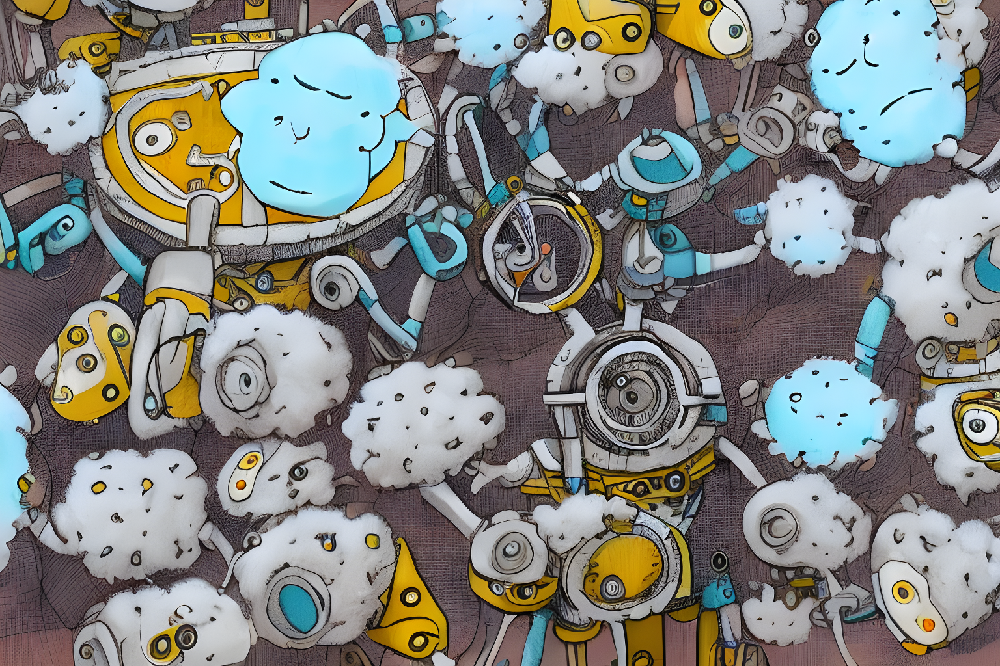
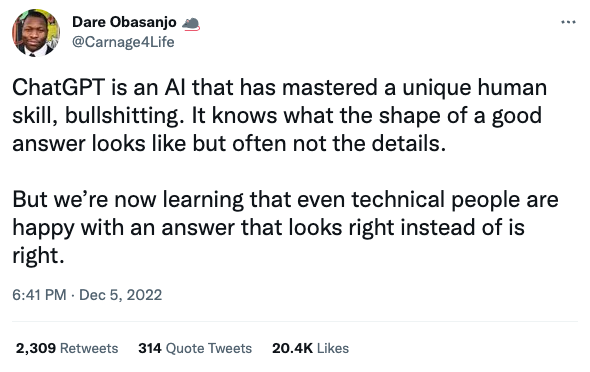
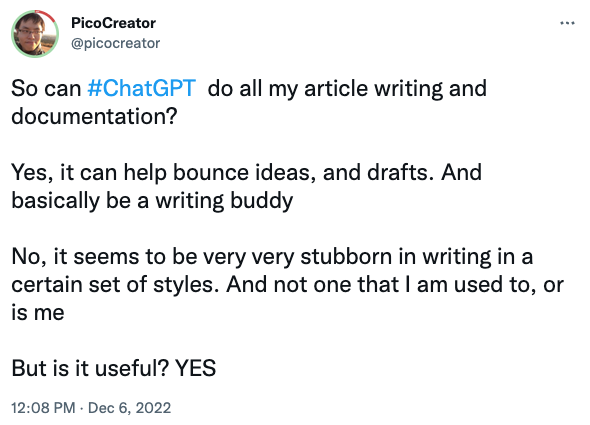

with large language models (like chatGPT), and AI art generation - everything we know about tech in the next few years, maybe changing drastically

> This article focuses more of the current state of AI, on 5th Dec 2022. As a means of briefing others outside this industry, what has been going on recently, and what are its limitations. With a focus on recent developments in chatGPT, over long term speculations.
> 
> Recommended music for the article - GITS Stand Alone Complex: Be Human
> [youtube music](https://music.youtube.com/playlist?list=OLAK5uy_meCQS7-RZ4TX2ku8XkVGxW41J9gkfQTto&feature=share), [spotify](https://open.spotify.com/album/4yXX0zQxFl88hAV7FauBZ7)

In 2022 artificial intelligence (AI) has made some major strides in its capabilities. Largely in the two following area
- Prompt to text generation
- Prompt to image generation

Collectively, these "prompt-to-output" models are designed to take a prompt (or a question) and generate a finished product in either text (like a clickbait headline, or programming code) or image form (an illustrated art image, or stock images) based on that prompt. 

This type of AI is incredibly powerful due to how simple it is to use, and has the potential to revolutionise many different fields, and can literally feel like magic.

An example would be how a single prompt like

> [Hey, I'm trying to come up with some interesting, fantastical way of decorating a living room for a design project](https://twitter.com/GuyP/status/1598020781065527296)

Can be used to generate the following image

Or write buisness plans for a website

![[chat-gpt-turbo-tax.jpg]]

Or even be used to help [generate entire novels](https://andrewmayneblog.wordpress.com/2022/11/30/collaborative-creative-writing-with-openais-chatgpt/)

Because its full scope of its capabilities really requires you to try it, to better understand the potential for yourself. I would highly recommend giving these services a try, while its still free at https://chat.openai.com/chat (it may turn to a paid service in future) 

## Holy Crap, can it generate anything?

Yes, but that includes dreaming up lies. 

In an extremely convincing fashion that even experts can find it hard to tell the difference.

It can also be very stubborn in how it present itself, so as hard as i tried to get it to help me write this article, unfortunately it just couldn't be "me".

In a weird way, you should view these AI as unique assistant who ...
- is a naive smart kid
- who is slightly high or dreaming in the clouds
- have very unique and flawed views
- and is very willing to bluff their way, in providing a response, even if they dun have the answers

If you ever dealt with such an individual, you know that there are random nuggets of pure gold wisdom that they will say from time to time, and bulls#!t you will need to filter, as it dreams up the answer.

> The later act of filtering, is potentially the biggest danger of this new technology.
> 
> As it can be very very difficult, because of how convincing the AI structure its answer, if you are not an expert in the respective field. 
> 
> For example, as an experiment, I asked it questions in domains i had zero (or even negative) expertise, like cooking or chemistry. And I realised I have nearly no capability, in validating its bluffs.
> 
> This is despite my best attempts to google and fact check it at times, where it may give sometimes answers that is slightly different, but I have honestly no idea if its right or wrong. Unless I try it myself.
> 
> Which can potentially be dangerous, seeing as how it can get things wrong in my area of expertise.

## How is that possible, wasn't it trained on nearly a terabyte of data?

Yes, but it is not thinking, it is dreaming.

To elaborate, let’s start with an oversimplified explanation on how these AI models fundamentally work.

> First the AI is given a large dataset of articles or images from various sources, it uses this data to provide the foundation of its knowledge, loosely connected together. This is then trained together with possible prompts and responses given by the user.
> 
> Once this is completed, we have a working neural network or trained model with all this loosely connected data. Frozen in time.
> 
> When a prompt or question is given, the AI is not thinking of an answer or deliberating from the trained model. In a way, it is hallucinating the answer using the snapshot of knowledge it has.

Now, lets use a human analogy instead

> The human analogy, would be your brain right now, with all your past knowledge, or experiences in school or in life. Snapshot and recorded, in your head. Minus your emotions, and your feelings, or anything hormonal related.
> 
> When a prompt is given, imagine it as being told to you, before going to sleep into a dream. For example "go buy milk tomorrow, when you wake up".
> 
> For most folks, sleep is when they as an individual have little to no control with how the story goes (ignoring the lucky few lucid dreamers).
> 
> In this state, your mind in its dream state, starts to take that last phrase that is stuck in your head, and starts dreaming a story around that phrase.
> 
> Where you are an individual inside a dream, and your brain the dream world doing its best to be as convincing as possible that its real and not a dream world, continuously writing the story back and forth with your interactions and actions.
> 
> All while using the snapshot of all your past knowledge and experience, in your brain. To make your dreamworld as realistic as possible

Flipping it back around

> You, with your prompts is a participant in a dream.
> With the AI being the dream world, trying its best to be, as convincingly as possible, a good dream. Where it answer your questions in a very belivable manner.
> 
> And just like your dream world, it can be at times entirely realistic, and factually accurate, or as imaginary (and perhaps exciting) as it wants to be

As such, this dreamlike state, allows it both to make basic math mistakes with high confidence

![[tweet-bad-math.png]]

To hilariously answer questions as a cat when instructed

![[tweet-in-meow.png]]

To very impressively, even emulating interactions with a virtual machine (rather accurately!)

## What does it mean for the future of work?

It's difficult to predict exactly how the advancements in AI will impact the future of work, but there are some potential scenarios to consider.

One thing that seems clear is that the current wave of "prompt-to-output" models is having its "iPhone revolution moment". Just as the iPhone changed how everyday people interact with software and ushered in the era of smartphones, prompt-to-output models have the potential to change how we work and interact with tools.

It has already started fundemnatlly changing industries, today. Especially in SEO copywriting, and stock illustration / photo industries.

The next wave could manifest in waves of AI assistant work tools and practical enhancements to existing tools, ultimately making automation more accessible and lowering the barrier of entry for performing tasks.

Regardless of the forms of changes, this is a significant development and every startup founder (including me) and product owner should be taking note of how to integrate AI into their business. Just as the smartphone/iPhone era made entire industries and tools obsolete and created new domains of app-based tools, the rise of AI has the potential to do the same.

However, it's important to note that not all tools will be impacted by AI. Some industries, may not see much change beyond a new skin or UI. Only time will tell which side your business falls on.

> PS: if you are feeling FOMO, and is in the tech industry, chill - the iPhone and app revolution happened in months and years, not days. Do go on with your life, and your holiday plans.  
>   
> As long as you are not ignoring the potential changes, and making steps towards it - you are good.
> 
> If you are outside the tech industry, keep a look out, be ready to learn new tools, across the next few years - that may change your industry. And be prepared to learn and use them to your advantage.

~ Until next time 🖖 live long and prosper