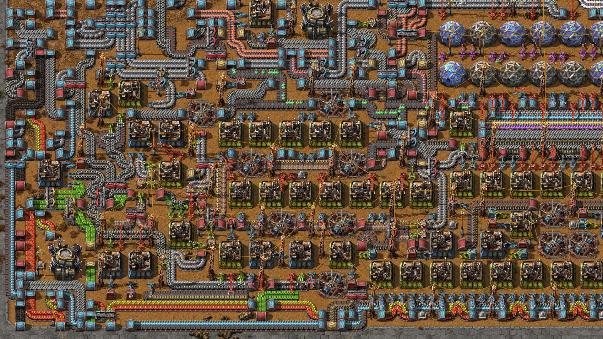

> All the fun of being a software engineer, minus all the pain


If you ever wanted to know how it feels like to be a senior software engineer, and experience ...

- The joy of coming up with experiments, and testing them to solve problems
- The craftsmanship of building either building small hyper-efficent systems, or
- The pride in building large hyper scale systems.
- All within either a fixed constraint or the lack of it

Factory building games, allows you to experience all of them in a highly compressed timeframe of hours instead of days. All without the common frustration and pains that comes with programming. (Weird obscure library bugs, lack of documentation, Company politics or bureaucracy in processes, budget ... )


> Dun take my word for it, let reddit comments of one of the games in the genre speak for itself

---

## What is a Factory Building Games?

Factory Building Games, or FBG for short, are at its core about

- Constructing and expanding a large base of multiple building blocks ...
- Connected together to build products using an ever-growing continuous supply of materials ...
- To continuously feed a very intensive "resource sink" (the games goal) ..,
- Which runs automatically without the player interaction for long periods of time


One of the key differences between FBG, and typical resource management games. Is the endless continuous nature of the main production lines, due to the usually infinite scaling nature of the "resource sink". Allowing everything to run "infinitely" without player interaction.

Said "resource sink" may differ from game to game, but it's typically some combination of the following
- Researching new tech, some which are endlessly repeatable 
- Sustaining a colony of citizens, that grows in both size, and resource requirements
- A definitive end game goal, with enormous requirements (launch a rocket, build a Dyson sphere, etc)

While this may sound simple enough. Another common feature, is how as the game progresses. It would require more advance products and buildings, that requires other products built by the factory system itself. Which constantly scales up complex combination requirements.

At late game, it is not uncommon for products that are needed for the game goals, to require a process that involves over a dozen parts, and hundreds of steps.

Resulting into a complicated large scale processes, running continuously; Which mirrors some real life factories, hence the FBG title. 
 
This gradual ramp up in complexity encourages constantly scaling up both consumption and production. All while constantly refactoring or updating the factory layout for optimisation, as new "methods of production" is unlocked.

---

## How it makes you a better programmer - by making you practise everything else but code!

To understands the similarities between software development as a programmer, and playing an FBG as a gamer. We start by looking at a typical workflow for a programmer, where each task spans weeks to months


> Individual experiences may very differ between companies, but roughly stays the same. Emoji’s express the typical emotion involved for each activity.

Now contrast to the typical gameplay experience of a FBG.


Notice the huge similarities, and how it compresses all the programmers day to day activities down to hours. While nearly removing all the unpleasant and potentially frustrating bits!

Despite ironically removing coding (one of the most critical things a programmer does). It rapidly speeds up the loop of planning, testing and iterating. At a much faster pace than the real world.

This allow a player to practise systems thinking, which is critical to programmers. 

It does so, by forcing the player, to split the problem in game into smaller tasks, while using their existing tools and knowledge to solve them. Before forcing them to do the inverse, in putting together large complex systems, using the same "blueprint" of what they built previously.

This process of making smaller changes, and integrating such changes to the larger system, is part of the day to day of software engineering. (including all its failures and iterations)

Additionally, due to its nature of being a "game" - and the lack of "real life consequences". Most of the negative emotions that come with failure are minimised. This encourages the player to learn quickly through experimentation and failure.
 
All while avoiding overwhelming the gamer, due to the limited nature of the toolbox in the game. Allowing the player to gain satisfaction, from the mastery of said tools

Hence, despite the exclusion of code. It teaches the gamer/programmer, very essential skills in software development. As it’s worth repeating that ...

> Coding is often only only half the battle for a programmer.

There is a flip side though - which should come with a warning label. This game genre can be very addictive, due to how well refined the positive feedback loop is.

> "It's the one video game (factorio) that everyone at Shopify can expense”.
> ~ Tobi Lutke, CEO of Shopify

---
## Sounds good, how can I get started?

You can find the full list of FBG games at : https://github.com/PicoCreator/awesome-list-factory-building-games

However, because the full list can be overwhelming, here are some quick highlights ...


[Dyson Sphere Program](https://store.steampowered.com/app/1366540/Dyson_Sphere_Program/) which is a pure FBG in space, with really nice 3D visuals. Also building a Dyson sphere around the sun, is a cool mega project in itself


[Satisfactory](https://store.steampowered.com/app/526870/Satisfactory/) which uses FPS/Fortnite like controls, not recommended if you are not used to such a control scheme - supports multiplayer.


[Factorio](https://store.steampowered.com/app/427520/Factorio/) which is the most popular in this genre - is only recommended for more experience gamers. In my opinion it's not beginner friendly. However it supports really large scale multiplayer gameplay (50+ players), making it popular with larger teams.


[Autonauts](https://store.steampowered.com/app/979120/Autonauts/) is one of the notable FBG that includes simple programming blocks, for its "automation bots". Adding the code element back into FBG. It does loose however the iconic conveyer belt (to force you to use the bots), while sadly simplifying many things (can be too easy)

> If you find yourself struggling with a particular game, try to takes things slow instead of rushing it. Part of the fun is to overcome these challenges.
> 
> Also, Some FBG may include other game mechanics like endless combat/war. this can drastically change the style of the game, as such when possible I would recommend "peaceful mode" for new players. To focus on the FBG gameplay.

---

## I did not like the games you recommended, does that make me a bad programmer?

NO

There are many good programmers who dun like games

There are many other reasons why one may find joy in programming that is not found in these games. Most notably
- personal satisfaction from providing positive impact to users
- Personal satisfaction from solving coding tasks

Similarly there are many other valid reasons why you may dislike a certain part of the game which makes it a dealbreaker. Or even just video games in general.

So while there is some truth that if you enjoy FBG, you probably will enjoy programming (and vice-visa). It is worth reminding that correlation is not causation.

So you be you 

However, for programmers, who do enjoy playing such games. Good for you, as this is one of the few games which can help both practise your skills, and have fun outside your workhours.

> Separately, For non-programmers who is aspiring to be a programmer, completing an FBG, will help you get a better idea of the ideal workflow of a programmer. Which in itself, is a huge benefit, if you are outside the tech industry, and want to see if such work is suitable for you 

------
## Shameless plug: How can Uilicious.com automate cross browser testing, to make my website development more "Satisfactory"

Is manually testing your websites, prior to production deployment a huge time sink and pain?
Find existing website testing tools too complicated for your team to use?

Give [uilicious.com](https://uilicious.com) a try today, with our easy to use testing commands, which anyone, even manual testers can easily learn.

An example would be the following code snippet for a simple login test

```
// 🌐 Lets load up the website
I.goTo("https://github.com/login")

// 📝 Lets fill up the form
I.fill("Email", "john@example.com")
I.fill("Password", "supersecretpassword")

// 👉 Lets click on Sign in
I.click("Sign in")

// ⚠️ and properly check for the error
I.see("Incorrect username or password.")
```

Which would provide the following test results

[](https://snippet.uilicious.com/test/public/5994LUfLZKidFGJGiTxUyG)

Making testing websites on the internet quick and easy.

~ Eugene Cheah
  CTO / founder of Uilicious.com 