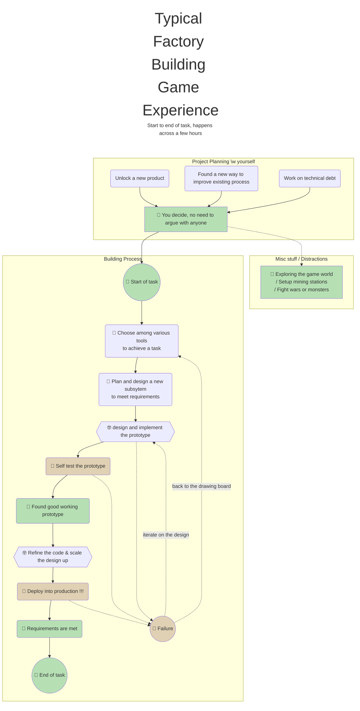

```mermaid
%% imgs is generated via : https://mermaid.live/ %%
graph TD
    %% This is a "workaround" block to provide a title like header
    title[<font size=19>Typical Factory Building Game Experience</font>\nStart to end of task, happens across a few hours]
    style title fill:#FFF,stroke:#FFF;

    title---A1
    linkStyle 0 stroke:#FFF,stroke-width:0;
    title---A2
    linkStyle 1 stroke:#FFF,stroke-width:0;

    subgraph SG1 [Building Process]
        C1(("🙂 Start of task"))
        C1 --> D1

        D1("🤔 Choose among various tools\nto achieve a task")
        D2("🤔 Plan and design a new subsytem\nto meet requirements")
        D1 --> D2

        E1{{"🤓 design and implement the prototype"}}
        D2 --> E1

        E2("😬 Self test the prototype")
        E1 --> E2

        G1("🥳 Found good working prototype")
        G2{{"🤓 Refine the code & scale the design up"}}
        E2 --> G1
        G1 --> G2

        H1("😬 Deploy into production !!!")
        G2 --> H1

        J1("🥳 Requirements are met")
        H1 --> J1
        
        X1(("🥳 End of task "))
        J1 --> X1

        ZFAIL1(("😬 Failure"))
        E1 -.-> ZFAIL1
        E2 -.-> ZFAIL1
        H1 -.->ZFAIL1
        ZFAIL1 -.back to the drawing board.-> D1
        ZFAIL1 -.iterate on the design.->E1
        
        %% Red failures
        style ZFAIL1 fill:#e0d1b4

        %% organge stressors
        style H1 fill:#e0d1b4
        style E2 fill:#e0d1b4

        %% Green happy stuff
        style C1 fill:#b6e0b4
        style G1 fill:#b6e0b4
        style J1 fill:#b6e0b4
        style X1 fill:#b6e0b4
    end

    subgraph SG2 [Misc stuff / Distractions]
        Z1["🙂 Exploring the game world\n/ Setup mining stations\n/ Fight wars or monsters"]

        %% Green happy stuff
        style Z1 fill:#b6e0b4
    end

    subgraph SG3 [Project Planning \w yourself]
        A1(Unlock a new product)
        A2(Found a new way to improve existing process)
        A3(Work on technical debt)
        A1 --> B1
        A2 --> B1
        A3 --> B1
        B1["🙂 You decide, no need to argue with anyone"]

        %% Green happy stuff
        style B1 fill:#b6e0b4
    end
    B1 --> C1
    B1 -.-> Z1
```