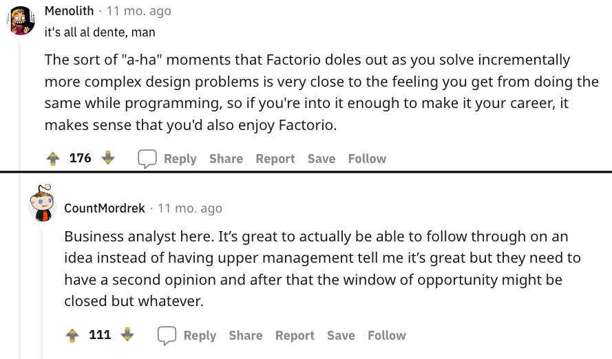

<@TODO: Screenshot compilation of some FBG>

If you ever wanted to know how it feels like to be a senior software engineer, and experience ...

- The joy of coming up with experiments, and testing them to solve problems
- The craftsmanship of building either building small hyper-efficent systems, or
- The pride in building large hyper scale systems.
- All within either a fixed constraint (or the lack of)

Factory building games, allows you to experience all of them in a highly compressed timeframe of hours instead of days. All without the common frusfration and painpoint of programming. (Wierd obscure library bugs, Company politics or burecracy in processes, budget ... )

Dun take my word for it, let reddit comments of one of the games in the genre speak for itself

## What Are Factory Building Games?

Factory Building Games, or FBG for short, are at its core about

- Constructing and expanding a large base of multiple building blocks
- Connected together to build products using an evergrowing continous supply of materials
- To continously feed a very intensive "resource sink" (the games goal)
- Which runs automatically without the player interaction for long periods of time

One of the key differences between FBG, and typical resource management games. Is the endless continous nature of the main production lines, due to the usually infinite scaling nature of the "resource sink". Allowing everything to run "infinitely" without player interaction.

Said "resource sink" may differ from game to game, but it's typically some combination of the following
- Researching new tech, some which are endlessly repeatable 
- Sustaining a colony of citizens, that grows in both size, and resource requirements
- A definitive end game goal, with enormous requirements (launch a rocket, build a Dyson sphere, etc)

While this may sound simple enough. Another common feature, is how as the game progresses. It would require more advance products and buildings, that requires other products built by the factory system itself. Which constantly scales up complex combination requirements.

At late game, it is not uncommon for products needed for the game goals, to require a process that involves over a dozen parts, and hundreads of steps in the whole supply chain. 

Resulting into a complicated large scale processes, that mirror some real life factories.

This gradual ramp up in complexity encourages constantly scaling up both consumption and production. All while constantly refactoring or updating the factory layout for optimisation, as new "methods of production" is unlocked.

## How it makes you a better programmer - by making you practise everything else but code!

Here is an example work loop for a programmer...

(@todo)

Here is an example game loop for a typical FBG ...

(@todo)

While it does remove one of the most critical things a programmer does: coding. 

It compresses all other activities down to hours, while nearly removing all the unpleasant bits.
Reducing it down to planning, testing and iterating. At a much faster pace then the real world.

It makes you practise systems thinking, as you play the game. Where you split the problem into smaller tasks, and use your existing tools and knowledge to solve them. It also allow your to practise on how to put together large complex systems together, using the same "blueprint" of tools you have built on smaller scale.

> Additionally, because the toolbox is extreamly limited, it avoid the trap of getting lost in the nearly endless possiblity nature of programming, which can at times feel impossible to keep up (our industry jokes about having a new framework every few weeks). This allow you as the player to focus on the mastery of said tools instead (which is more important!).

You would think, that the exclusion of code itself, would make it pointless. But in reality, coding is often only only half the battle for a programmer.

And such games can be so effective at training such skills, that some of titles such as factorio, which allows it to be played in a multiplayer setup - which encourages team communications - is one of the rare few games some engineering companies allow to be expensed.

(Shopify quote)

And the flip side though - it should come with a warning label, this game genre can be very addictive.

## Sounds good, how can I get started?

You can find the full list of FBG games here

> If you find yourself struggling with a particular game, don’t be afraid to reach out for help, or search for online guides. There are plenty of online resources (including forums and walkthroughs) that can assist you. In addition, many factory building games have tutorial levels that can teach you the basics.

If you are not a gamer: Any game from the Anno series

If you are gamer, especially of the 4x or RTS genre: Dyson Sphere Program
If you are primarily an FPS or Fortnite player: Satisfactory

> Some FBG may include other game mechanics (labeled distractions in the loop) like endless combat/war. this can drastically change the style of the game, as such when possible I would recommend "peaceful mode" for new players. To focus on the FBG gameplay.

## I did not like the games you recommended, does that make me a bad programmer?

NO

There are many good programmers who dun like games

There are many other reasons why one may find joy in programming that is not found in these games. Most notably
- personal satisfaction from deliving positive impact to users
- Personal satisfaction from solving coding tasks

Similarly there are many other reasons why you may dislike a certain part of the game which makes it a dealbreaker. Or even just video games in general.

For non-programmers who is aspiring to be a programmer, completing an FBG, will help you get a better idea of the ideal workflow of a programmer

So while it is some truth that if you enjoy FBG, you probably will enjoy programming. It is worth reminding that correlation is not causation.

So you be you 

------

## Shameless plug: How can I automate cross browser testing, to make my website development more "Satisfactory"

<@TODO: Pitch block>

-------

Random junk draft bits

- Don’t be afraid to ask for help: If you find yourself struggling with a particular game, don’t be afraid to reach out for help. There are plenty of online resources (including forums and walkthroughs) that can assist you. In addition, many factory building games have tutorial levels that can teach you the basics.

At their core, FBGs are games that allow you to build and manage your own factories. This might sound simple, but the level of detail and complexity that goes into designing a functional factory can be surprisingly rewarding.

What makes FBGs so special is that they allow you to apply the principles of real-world factory design and management to a digital environment. This not only makes for a more immersive gaming experience, but it also teaches you about the inner workings of factories in a way that no textbook or lecture ever could.

## Introduction

Have you ever wanted to learn programming but been intimidated by the thought of it? Have no fear! Introducing Factory Building Games, a new game that will teach you the basics of programming in a fun and easy way.

Factory Building Games is a game that simulates the process of creating a factory. You start with a small, simple factory and must make decisions about what products to produce, what machines to use, and how to optimize your production. As you play, you will learn the basics of programming such as loops, conditionals, and arrays.

Best of all, Factory Building Games is free and easy to play. So what are you waiting for? Start playing today and become a programming master!

## How Can Factory Building Games Make You a Better Programmer?

## Examples of Factory Building Games

It can be difficult to find a good game that will teach you how to program. But, luckily, there are a few games that can help. One of these games is Factorio. In Factorio, you have to build factories to produce products. This teaches you the basics of programming in a fun and interesting way.

Another game that can help you learn programming is Minecraft. In Minecraft, you can create anything you want by using blocks. This teaches you how to think logically and creatively.

## How to Get Started With Factory Building Games

Now that you know a bit more about what factory building games are, you might be wondering how you can get started with them. Here are a few tips:

- Do some research: When it comes to factory building games, there are a lot of different options out there. So, it’s important to do some research and figure out which game is right for you. Consider things like the game’s mechanics, its level of complexity, and whether or not you want to play it online or offline.

- Start with a simple game: Once you’ve narrowed down your options, it’s time to start playing! However, rather than jumping into the most complex game you can find, it’s probably a good idea to start with something simpler. This will help you get a feel for how these types of games work and give you a chance to learn the ropes.

## Conclusion

If you're a programmer, you know that it's important to stay sharp and keep your skills up to date. One way to do that is by playing factory building games.

Factory building games are a great way to learn about different programming concepts and to practice your problem-solving skills. They can also be a lot of fun. So why not give them a try? You might be surprised at how much you learn.
