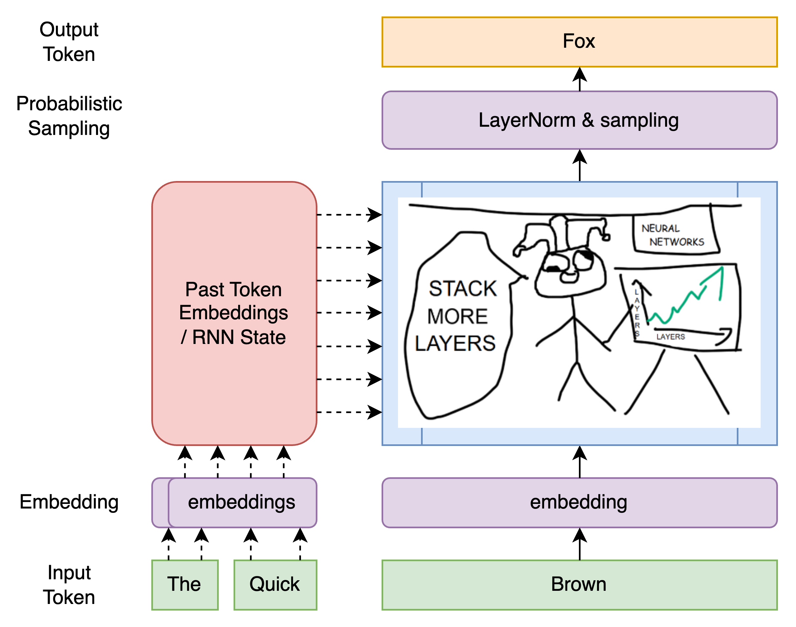
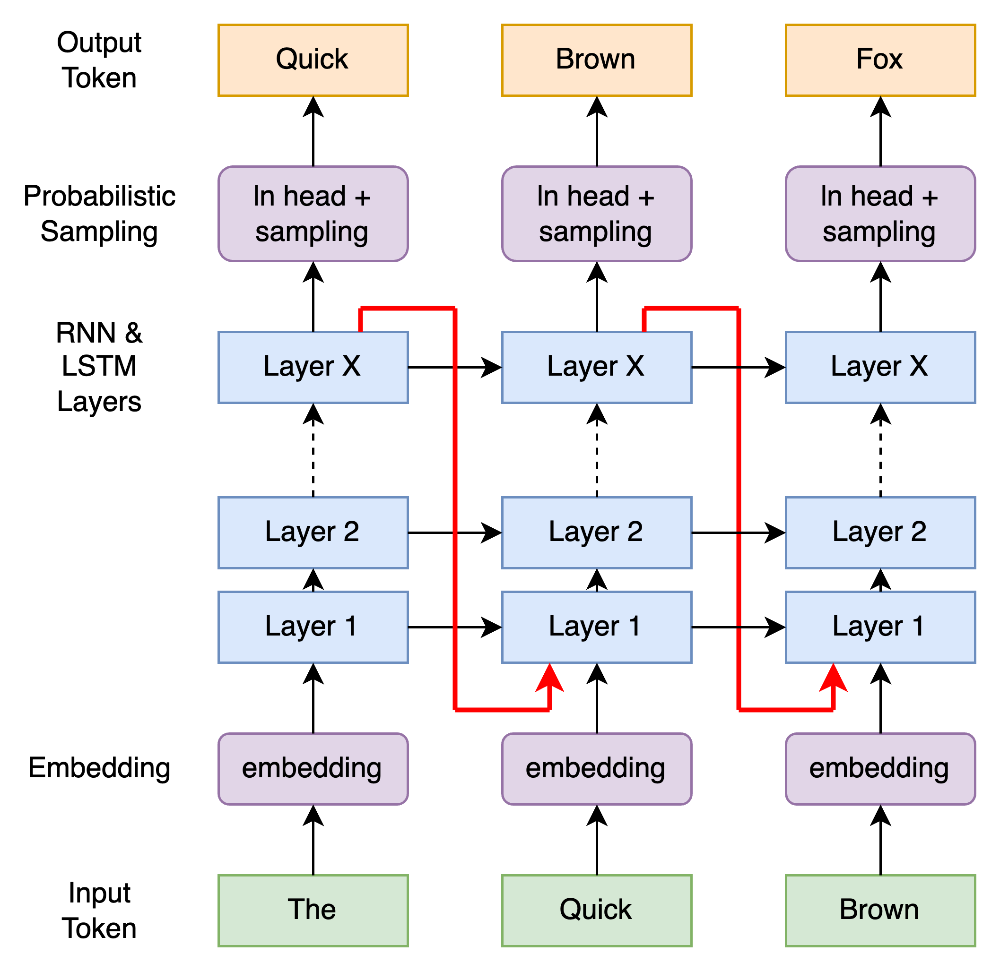
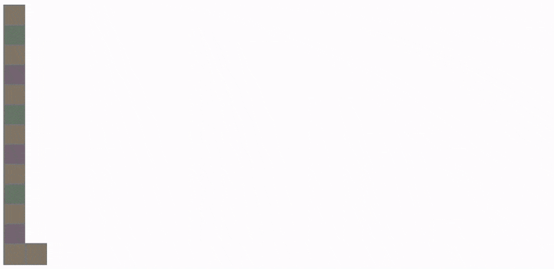
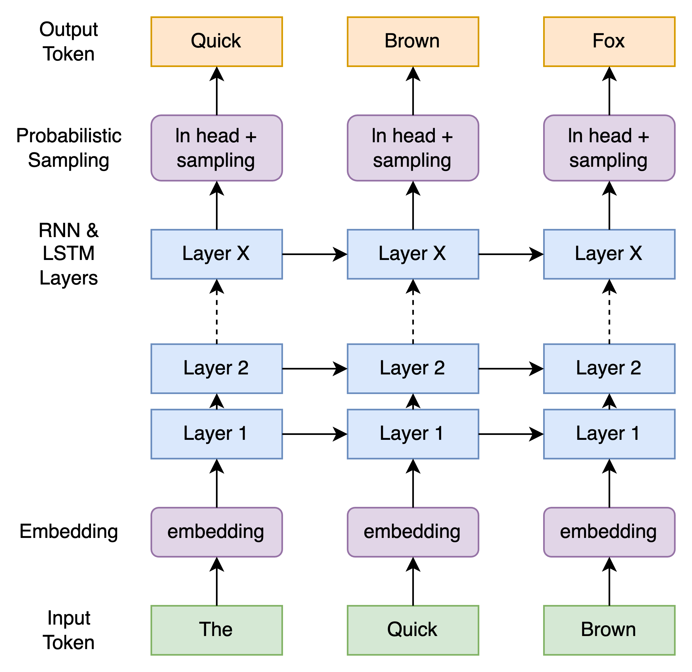
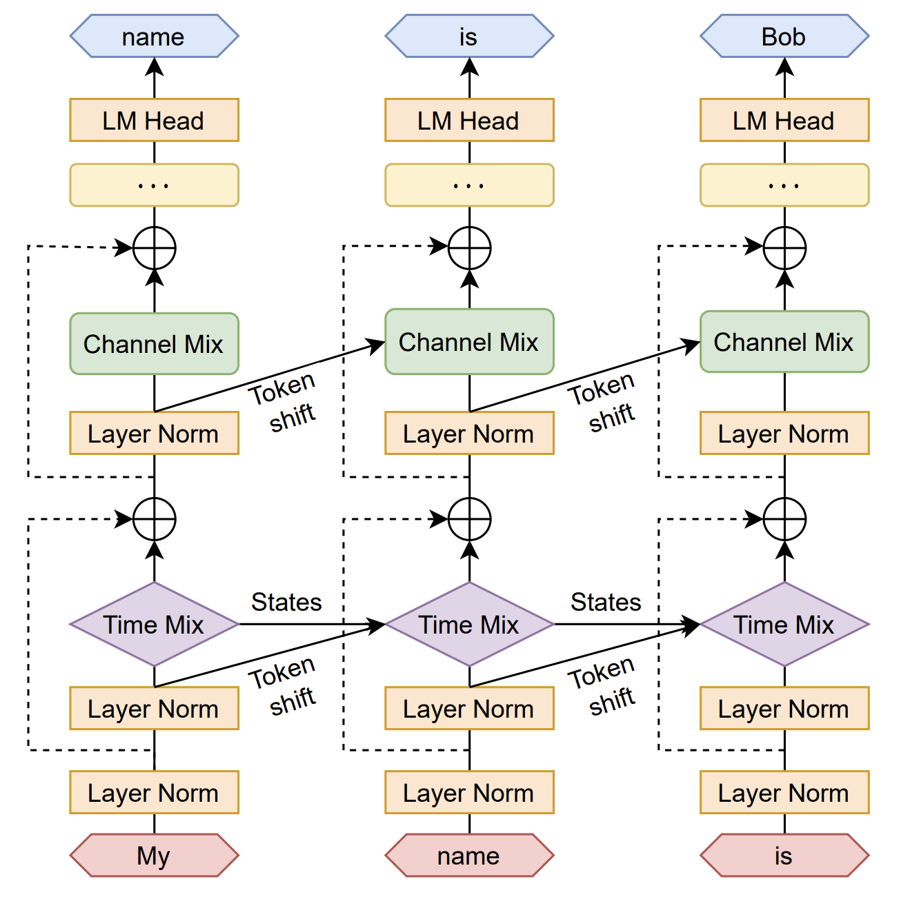

The RWKV architecture present in general 2 major ideas, in helping scale RNN to be as performant as transformer in both speed and quality. We would be covering the main design features in three section

- Crash course into some Transformer and RNN terms
- Scaling an RNN to transformer scale
- Replacing QKV / LSTM with RWKV

This article also assumes you have some basic familiarity with programming. No AI PHD required.
If you are already familiar with AI/ML transformer architecture, skip to section 2.

> Note we will only be focusing on the v4 architecture, as covered in the paper, and not the newer upcoming v5 architecture. For most part, the key concepts should stay the same.

# Section 1: How AI models work in a nutshell
## (@TODO) How AI text models work at a high level

- explain high level, like its a black box
- explain embedding
- explain state
- explain sampling
- show example using psuedo code (Black box the AI)
- show how transformer QKV work on a high level
- show how RNN state optimises this code

[RWKV in ~100 lines](https://johanwind.github.io/2023/03/23/rwkv_details.html)

# Section 2: Scaling RNN to transformer scale

Lets take a step back, on a very fundamental level AI models for RNN or Transformer are input/output models with the following architecture



They all in generally do the following, 
- take in text tokens, 
- convert them to embeddings
- pass them through lots of magic layers
- normalise them to an array of probabilities
- and pick a token from the output

The issues for RNN with LSTM however was not that they dun work. [They are unreasonably effective](http://karpathy.github.io/2015/05/21/rnn-effectiveness/) - they were just too slow to scale and train to any usable size.

## The issue with RNN scaling ?

Traditional RNN was replaced by transformers due to its slow training speed / scaling. While they were efficient on CPUs compute, they were really really bad in using GPUs

The main issue behind this is the sequential nature of RNN



Note the critical line in RED, where state information is passed from the last layer on the first token "The", to the first layer of the second token "Quick". Producing the following sequential pattern


> https://jsfiddle.net/r5yv0a8g/24/

Which to put it lightly, is slow as ass - and gets worse as you "stack more layers"

### The solution to RNN scaling? Remove that damn red line 



If you notice this is extremely similar to the RWKV architecture 
( lets ignore what channel / time mix is, and treat them like layers )



The general idea is consistent. Each layer is only allowed to view state information from lower layers or sibling layers.

And with just that removal, the following ends up being the optimal cascading pattern instead, allowing the architecture scale much better with GPU's in parallel


> https://jsfiddle.net/buLswgem/31/

> Note the cascading digram is the theoretical design, in practise some trainers and/or inference implementation may batch the cascade to chunks of tokens (32/64/128/256/512), to reduce VRAM lookup and latency, and improve overall performance.

### Wait, so removing that LSTM state flow (the red line) just works?

In terms of scaling, yes - while this may seem dead simple in hindsight. It is "in my opinion" a big half of RWKV innovation, of how it allows RNN to be trained in a scalable manner (as duh as it is).

However, because we removed a fundamental core of LSTM, the model will perform poorly. But that brings us to the next section.

# Section 3: Replacing QKV & LSTM with RWKV

First let's go through the key components of QKV attention, when given the input embeddings. We generate an output embedding.

For simplicity let's assume the embedding size is 1024, and the number of input tokens be 50, this gives us the following values.

- Q is a 1D tensor of size 1024 - derived from the input embedding (last token, or previous layer) 
- K is a 2D tensor of size 500, and 1024 - derived from all tokens embeddings
- V is a 2D tensor of size 500, and 1024 - derived from all tokens embeddings

Q, is matrix multiplied against K, softmaxed, and matmuled against V again

```.python
# calculate dot product between Q and K (transpose K for correct shape)
dot_prod = torch.matmul(Q, K.t())  # shape is [1, 500]

# scale the dot product by sqrt of dimension of key (assuming it's 1024 here)
scaled_dot_prod = dot_prod / torch.sqrt(torch.tensor(1024.))

# softmax to get attention scores
attention_scores = F.softmax(scaled_dot_prod, dim=-1)  # shape stays [1, 500]

# multiply scores with V (attention_scores is expanded for correct broadcasting)
output = torch.matmul(attention_scores.unsqueeze(1), V).squeeze(1)  # shape is [1, 1024]
```
