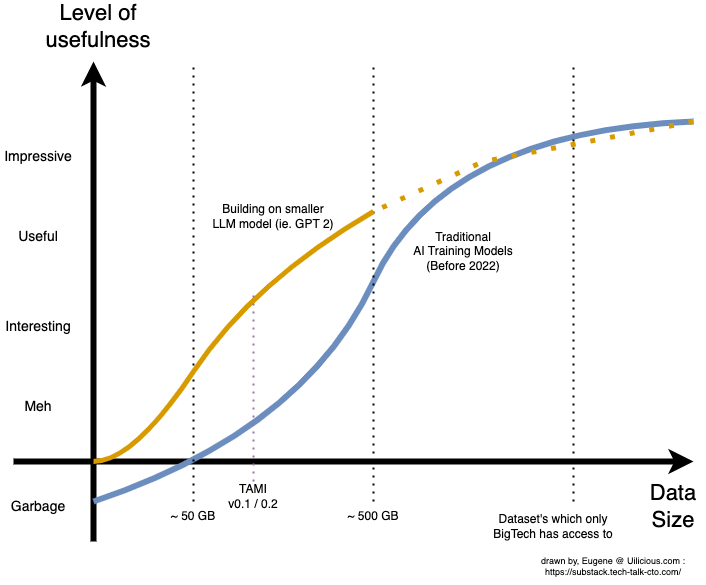
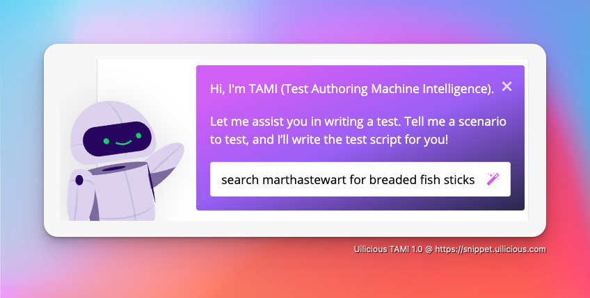
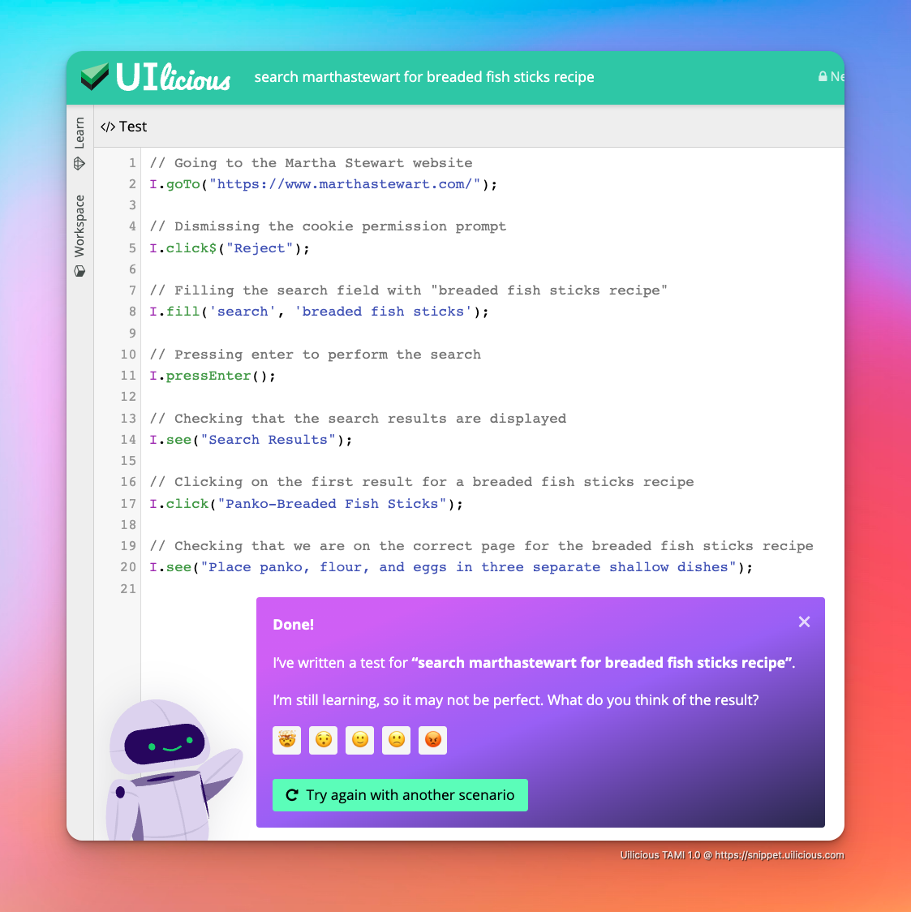

> Alternative title - VC & Founders Note : ChatGPT / LLM , and why its a major change moving forward
> 
> A summary, with extended materials. On our key insights and learning points in implementing our own UI test automation AI with GPT-3.5 - this is intentionally written for non technical folks ( ie. CEO's, VC partners, Analysts )

## TLDR 

Lets ignore the public hype that is chatGPT for a moment, its ethics or its implications to society, and lets focus on the implications on building an AI based on its research and the tech, for your startup or your portfolio.

TLDR: Dataset is no longer a hard requirment

>**_The idea that you need tons of data to make text based AI useful  is now partially outdated_**
>
>**_Even an extreamly small dataset can produce valuable results (1 sentence ~ 1GB) Something which nearly all startups are either sitting on, or is able to produce by hand_**

TLDR: It has very broad use cases

> **_You can think of GPT 3.5 as a remote & paid “college intern on demand”_**
> 
> **_You can never trust interns to be 100% right, but they can provide useful value with  proper supervision, guidance and planning
> 
  Value which can now grow and scale seamlessly (unlike real human interns)

TLDR: Cost and Limitations 

> **_Classic unit economics model for SaaS and online services will be a challenge_**
> - It can cost anywhere from $0.01 to $0.50 for a single complex request
> - This can be cheaper then a help desk employee on a per answer basis
> - But is easily a million times more expensive then a typical website API call
> 
> **_OpenAI also has a (temporary) effective monopoly, for the infrastructure in this space, and can be both a partner and potential unintentional future competitor at the same time._**
> 
> **_As such, any startup using this technology, will need other defensible advantages_**

If you were on holiday, and have no idea what are ChatGPT or LLM (large language models) - you can find the briefing about the technology here : https://substack.tech-talk-cto.com/p/introducing-ai-chatgpt-and-how-it

So what do I mean in longer form? 
And what research and citations do I have to back up my statements?

---

## Part 1: Data is no longer a hard requirement

### Crash course on traditional text based AI data requirements ...

> Note that this article is talking only about text based models, and does not apply to image models in many cases (ie. computer vision)

Traditionally, the development of an AI model, typically involves building up a large enough dataset to build a dedicated AI model for a specific use case.

While different AI model training techniques and tools exists, to optimize the training processes or its computational costs, for various specific use cases. The size and quality of the dataset was still one of the predorminant factor in training an AI.

Resulting into a graph something like the following

> All numbers are large approximitions, and will change very drastically for different use cases, AI models, and data quality. Axis in the scales are intentionally made vague and inaccurate, because they are subjective, if you want technical numbers you can read the papers in the citations for specific use cases.
> 
> The general idea remained however, where small scale dataset produces effectively random data, and only starts slowly becoming better, before finally being somewhat useful at approximately the ~500GB part

This lead to the dataset arms race, in nearly every field of specialization related to AI (esp. anything computer vision related) - which played out across multiple startups from 2009 onwards till today - With several notable startup even being acquired in part for their valuble dataset (and usually talent).

And because the arms race was constantly escalating, it slowly reached the point where "unless you have a deal with an external big data provider", it harder and harder for new startups to compete with their AI models (small dataset), against the incumbents (larger crowing dataset).

> This was the case for us at uilicious.com (low-code UI test automation). Where we used our limited dataset, trained an AI model previously (called TAMI v0.1), and found that it was spewing garbage half the time.
> 
> So in the end this model set on the shelf, while we grew the company without AI, and build up our dataset

In a very overgeneralised and very non-technical fashion, AI trained in this way, will be refered to as "Specialised Models" from here onwards.

### The start of LLM or Large Language Models

However, in the quest for a truely universal or general purpose AI, especially in the fields of human speach interactions (as humans make for the most random of all variables). There was a push to train a new type of text based AI for extreamly large scale datasets of public data (think wikipedia, quora, stackoverflow, and maybe half of the internet text). 

Because these new models, were pushing of both the boundaries of dataset sizes, and model size (think brain size), the approach and methods used to build them started to diverge from specialised models (which tend to have more emphasis on accuracy and efficency)

AI models, trained in this way, are now collectively called "Large Language Models"

There was however, very huge downsides of taking this approach, some of which held back its application in many use cases
- Extreamly large datasets needed to be built, and maintained (GPT-3, used 45 TB)
- Training cost in millions of dollars (GPT-3 cost over $4M to train, GPT-3.5/chatGPT is presumingly higher)
- Limited use for specialised use cases, due to the lack of private training data
- Lower accuracy then specialised model, in specialised use case
- Is really expensive to run (more on this in limitations later)

> LLM was mostly dominately by Google (who already had the data, and had the motive to do so for their AI assistant) and OpenAI initially. Microsoft, Amazon, Apple, Salesforce, Meta, and a few others would join the race later. 
> 
> However due to the sheer size and cost to train such a model. It's generally reserved to major tech companies with deep pockets.

While the first few generation LLM may have gave disappointing results, as it lost out to nearly every specialised model in every task.

As the years passed, and they started scaling up in both dataset size, and modal size, its benefits started being more visible
- Facts and accuracy aside, it started being really good at talking to humans
- In many (but not all) cases : It is really good at learning new specialised knowledge when given the datasets in an appropriate format (you can't just dump it in)

Which made drastic changes to the curves ....

And started a new wave of AI backed buisness model in 2019. Where new startups can train new AI models ontop of existing LLM models, with dataset sizes within their reach. 

From chatbots, presentation slide generator, copilot, copywriting or even D&D games.

No longer was it in the exclusive domain of large tech companies. For a small fee in training, and running the AI on their infrastructure, openAI and google started opening up their model for others to build upon, as a means to profit from the LLM.

It was also benefical the the startups, because they no longer need the billions of dollars of R&D investment which was required to build these large models internally. Allowing to go to market faster with their proof of concepts.

However in a way, data was still king. It may have moved the curve to be more accessible, but it still required a team to build up large datasets, and tune the model. 

As a result, while many of the startups in 2019 found it significantly easier to build their prototype, many found it difficult to cross the "useful" threshold, as they need to scale up their dataset with dimnishing returns.

> This is consistent with early internal trials of uilicious.com TAMI AI models - basically it was between interesting to "meh"

But thats where things start to really change in 2022 ....

### How large language models are few shot learners ...

With GPT3.5 (or chatGPT as the internet sees it) coming out in the past month (Dec 2022). One of the biggest implications was in the technical details on how the model was trained, and fine-tuned.

When combined with the new model, it literally unlocks the possibility of making usable AI with extreamly small datasets. One that most startups are already sitting on it, or is able to create by hand. In ways that fundementally change how we should think about AI training.

> For us it was a shocking moment at uilicious.com, because what we found was that using only a small "<1GB" dataset of our entire larger "~100GB" dataset. Converted and optimized with the new training techniques.
> 
> We had already crossed the "useful threshold", where the AI can start being used by our users and was outperforming everything we had previously.
> 
> While further experiments in increasing our dataset, showed diminishing returns. The key take away was how small of a dataset was required, to "make a useful product".
> 
> It literally took us less time to build a proof-of-concept AI, finetuned using data for our priopriatry use case, then it took me to write this article.

And thats where it is a fundemental shift. You no longer need a specialised team, or even a specialised individual. It is very possible using GPT3.5 as a basic building block - to build up useful AI applications for various use cases.

For simple usecaes, the dataset can be as low as a single sentence or paragraph. For larger use cases it could be under 100MB or 1GB - a size that is very possible for a startup to handcraft and maintain.

Almost anything you can get chatGPT to do today, in some useful capacity, is something you can tune GPT3.5 for your use case with under a 100MB, and under a week.

Alternatively, if you can instruct chatGPT to act in a way that you find useful and of value, that maybe a potential startup idea to build around on its own.

A drastic reduction in required dataset, that allowed us to build a "useful" AI model with only a small fraction of our full dataset of our previously "useless" AI.

> Screenshot is a demo of our AI in action, generating full UI testing scripts, from a prompt

---

## Part 2: The hunt for use cases (and AI interns) has begun

### Lets have a more realistic framing of use case ...

One thing to get out of the way, GPT3.5, and all Large Language Model - do have limits on their accuracy and reliability. This is in part due to their nature of [dreaming out answers](https://substack.tech-talk-cto.com/p/introducing-ai-chatgpt-and-how-it).

In theory (yet to be proven) given a large enough specialised dataset, its accuracy can be drastically improved for specialised use cases. However, if you have such a large dataset, chances are you could already built "specialised models".

Ultimately though, this limit on accuracy and reliability, is only a critical issues in sensitvie industry (ie. medicine). And for most cases, is mearly a distraction in finding use cases.

**A healthier, and more realistic approach to the problem. Is to imagine GPT 3.5 as a remote & paid “smart college intern on demand”.**

Because realistically, the AI has all the same limitations in such use cases, in addition to being remote and online
- never trust interns to be 100% right all the time (let alone diagnose medicine)
- create a workflow, that allow the intern to safely provide useful value, with the appropriate supervision, guidance and planning.
- for 1 day or 1 month interns, you would create a formal training plan to quickly get them productive in 1 hour or 1 week of training, respectively.
- you should be paying your interns, they are not free (both for humans and AI)

The only real benefit the AI model has over real life interns
- They are not affected by school seasons
- You can scale both up and down at any second
- The training is something you can do once per batch, and scale up to as many instances

The downside the AI has over the humans
- They cannot get you coffee in person

Once you frame it along these lines, it becomes significantly easier to figure out how to slow in the AI into existing buisness processes or products.

Need to generate article ideas, get a one day intern.
Need to convert some propietary java to javascript code, get a one month intern, with some basic training on how to do the process.

So on and so forth. Where at no point of the process is the human removed from the loop in supervising and iterating with, the intern.

> On a slightly more technical level
> 
>- A one day intern, can be quickly be built using prompt engineering, anything you manage to get chatGPT to do fits into this category. The downside is, there is a practical limit ( about 2000 words ) of what you can fit into the training data. The plus side is you can experiment and set this up in seconds, and its very easy to setup or iterate with chatGPT.
>  
>- A one month intern (or anything in between), is where you start having a formal training dataset, which they can memorize and learn. They will be able to handle more situations according to the training materials. The downside is, you actually need to prepare that training materials: however combined with both techniques, it can get very far.

---

## Part 3: Cost and Buisness Limitations

### Cost per prompt, will make and break the buisness model

This is the biggest Achilles' heel, or weakness for this newer approach in AI of bigger and better models as a baseline. Because there is no free lunch, while its cheaper and easier to train for specialized task (in terms of dataset size), it is significantly more expensive to run compared to more traditional AI models.

It ain't cheap, the cost per prompt and answer range anywhere between 1 cent, to 50 cents. Depending on how much data was needed to train, or use in the process. 

This is drastically higher then a typical API server, which can handle a million request, per dollar.

To peraphrase it in a less technical way, within a frame of one second, it cost more in server hardware to handle one AI query for one user, then it is to serve a million user request for a typical medium sized shopify website.

And this is not due to OpenAI, or azure only trying to make a profit. Its down to pure server hardware infrastructure required to run such large models.

As a result, as powerful as it is, incoporating such Large Language Model AI, has a hefty price tag. And may not be applicable for all use cases due to this limitation alone.

The end result is, while many use cases can benefit the use of such an AI, not all use cases can afford it. And that should be an important consideration for any implmentation.

#### Example A: Support Service Chat
For a support service desk. A typical support staff, can handle 10 customer per hour, with each customer having an average of 15 back and forth prompts. If its 5 cent per prompt - this adds up to $7.50 an hour, if an AI was used to mimic a single support staff.

This is not only cheaper then the typical US call center staff median salary of $15/hour, it is also much more flexible (no staffing overhead, can scale up and down instantly)

Likewise it is also possible to take the same "intern" approach where these support AI serves only as L1 support, allowing the humans to handle the more complicated cases.

In this scenerio, it makes sense when done and scaled appropriately on a per prompt (or per hour basis)

#### Example B: A SaaS service to draft emails
The average office worker replies to approximately 40 emails per work day, or approximately 880 emails per month.

Even at 5 cent per email, that would be $44/month on average, per user, just to handle the email replies. What makes it worse, is that its resonable to expect that with such a service, an office worker would be able to reply more emails on average.

It would not be unresonable for the average is doubled to 2000 email, or $100 a month, in pure AI costs alone.

In this case, if the SaaS startup were to do a simple, lets say $10/month pricing - they can get into heavy potential losses over time.

It is for this reason, that the majority of the AI startups built on the newer model, tend to have some form of monthly point/credit system, as a means to limit each user, or bill them for excessive usage.

This pricing cost, and business model, runs counter to the typical, per user pricing model that is common in SaaS.

> It is expected that overtime, with better fine tuning and cost optimization, the price per prompt can go down. 
> 
> Another notable method, is to use the original more expensive AI first at launch, while collecting more data - which is then used to train a more specialised and cheaper model.
> 
> However all of these methods, go into deep technical details, which maybe unique for each use case, and generally require significant time and effort. And even then, while it can be a drastic 10x in savings - it is fundementally more expensive then traditional SaaS API services.

### OpenAI has an effective monopoly (for now)

#### Prices may be stuck, till competition arrives

While there are existing opensource Large Language Model, in very frank terms, they are either comparable to GPT2, or somewhere inbetween that and GPT3.5.

For some use cases, they may find that once they start building up a reasonable dataset, these smaller (and cheaper) models, will be useful to migrate into as a means of cost cutting.

However for some use cases, such a move may not be possible, due to the complexity of their AI - giving openAI an effective monopoly, with no insentive for lower pricing.

However it is believed that over the cost of the next 1 or 2 year, the opensource community would catch up. And in doing so, perhaps allow prices to improve, due to better alternative of infrastructure providers.

However because this is an uncertain future, it is worth highlighting

#### OpenAI is a potential unwilling competitor for some models

While not intentionally, it is critical that startups within this space, build feature sets that is defensible, beyond their prompt to text bots.

For example, there were several smaller startups who built GPT3 based bots or SaaS, around specific prompt to text use cases. Like name generators, or idea generators, with a simple interface.

Literally overnight, with the launch of chatGPT, these small single usecase text to text SaaS. Were made redundant, as everyday folks can now get the same functionality via chatGPT for free.

While it may not have been openAI intention, to compete with the very partners that build on them. It may be its inevitable nature to do so, as they keep improving their model and chatGPT.

As such to ensure this does not repeat itself, it is critical for any buisness model around this technology, to figure out what additional value do they provide beyond just prompt to text.

Perhaps its better user experience, or integrations with existing toolings, etc.

### Lastly: It ain't perfect
Reminder of the intern model - do not expect to use this for curing cancer tomorrow. 
So please do not go stuffing AI into every product and startup on earth, when it makes no benefit to the end user to do so.

----

~ Until next time 🖖  live long and prosper

