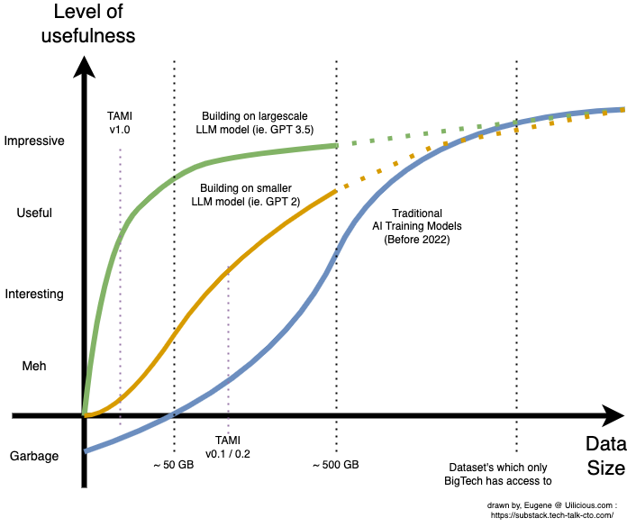

The article is now published at: https://substack.tech-talk-cto.com/p/vc-and-founders-note-chatgpt-llm

> Alternative title - VC & Founders Note : ChatGPT / LLM , and why its a major change moving forward
> 
> A summary, with extended materials. On our key insights and learning points in implementing our own UI test automation AI with GPT-3.5 - this is intentionally written for non technical folks ( ie. CEO's, VC partners, Analysts )

## TLDR 

Lets ignore the public hype that is chatGPT for a moment, its ethics or its implications to society, and lets focus on the implications on building an AI based on its research and the tech, for your startup or your portfolio.

TLDR: Dataset is no longer a hard requirment

>**_The idea that you need tons of data to make text based AI useful is now partially outdated_**
>
>**_Even an extreamly small dataset can produce valuable results (1 sentence ~ 1GB) Something which nearly all startups are either sitting on, or is able to produce by hand_**

TLDR: It has very broad use cases

> **_You can think of GPT 3.5 as a remote & paid “college intern on demand”_**
> 
> **_You can never trust interns to be 100% right, but they can provide useful value with  proper supervision, guidance and planning
> 
>  Value which can now grow and scale seamlessly (unlike real human interns)

TLDR: Cost and Limitations 

> **_Classic unit economics model for SaaS and online services will be a challenge_**
> **_due to the extremely high running cost of most LLM_**
> 
> **_OpenAI also has a (temporary) effective monopoly, for the infrastructure in this space, and can be both a partner and potential unintentional future competitor at the same time._**

If you were on holiday, and have no idea what are ChatGPT or LLM (large language models) - you can find the briefing about the technology here : https://substack.tech-talk-cto.com/p/introducing-ai-chatgpt-and-how-it

So what do I mean in longer form? 
And what research and citations do I have to back up my statements?

---

## Part 1: Data is no Longer a Hard Requirement

### Crash Course On Traditional Text-Based AI Data Requirements

> Note: This article is discussing only text-based models and does not apply to image models in many cases (e.g., computer vision).
 
In the past, building an AI model typically involved gathering a large enough dataset for a specific use case. Different AI model training techniques and tools existed to optimize the training process or its computational costs. However, the size and quality of the dataset was still one of the predominant factors in training an AI.

This would result in a graph something like the following:

> All numbers are large approximations and will change drastically depending on the use case, AI model, and data quality. The scales on the axes are intentionally vague and inaccurate because they are subjective. For technical numbers, read the papers in the citations for specific use cases.
> 
> The general idea remains, however, where small-scale datasets produce effectively random data before slowly becoming better and finally being somewhat useful at approximately the ~500GB part.

This led to the dataset arms race, occurring in nearly every field of specialization related to AI (especially anything computer vision-related). Which played out across multiple startups from 2009 onwards until today, with a few notable startups being acquired in part for their valuable datasets (and usually talent).

Because the arms race was constantly escalating, it became increasingly difficult for new startups to compete with their AI models (small datasets) against incumbents (larger datasets). 

> For example, at uilicious.com (low-code UI test automation), we used our limited dataset to train an AI model (called TAMI v0.1). We found that it was spewing garbage half the time, leading us to set the model aside and grow the company without AI while building up our dataset.

In a very overgeneralised and non-technical fashion, AI trained in this way will be referred to as "Specialized Models" from here onwards.

### The Start of LLMs or Large Language Models

In the quest for a truly universal or general-purpose AI, especially in the field of human speech interactions (as humans make for the most random of all variables), efforts arose to train a new type of text-based AI for extremely large datasets of public data (think Wikipedia, Quora, StackOverflow, and half of the internet text).

Because these new models pushed the boundaries of dataset sizes and model size (think brain size), the methods used to build them diverged from specialized models (which tend to have more emphasis on accuracy and efficiency). 

Text AI models trained in this way are now collectively called "Large Language Models" (LLMs).

The downside of this approach was huge, preventing its early application in many use cases:
- Extremely large datasets need to be built and maintained (GPT-3 used 45 TB)
- Training costs millions of dollars (GPT-3 cost over $4M to train, GPT-3.5/chatGPT is presumably higher)
- Limited use for specialized use cases due to the lack of private training data
- Lower accuracy than specialized models in specialized use cases
- Expensive to run (more on this in limitations later)

> LLM was dominated by Google (who already had the data and had the motive to do so for their AI assistant) and OpenAI initially. Later, Microsoft, Amazon, Apple, Salesforce, Meta, and a few others joined the race. 
> 
> However, due to the sheer size and cost to train such a model, it's generally reserved for major tech companies with deep pockets.

Though the first few generations of LLMs may have produced disappointing results, as they lost out to nearly every specialized model in every task, things changed as years passed and they scaled up in both dataset size and model size. 

Their benefits became more visible:
- Facts and accuracy aside, they became really good at talking to humans
- In many (but not all) cases: they are really good at learning new specialized knowledge when given the datasets in an appropriate format (you can't just dump it in)

This made drastic changes to the curves:

It also sparked a new wave of AI-backed business models in 2019. Startups could now train new AI models on top of existing LLMs with datasets within their reach, from chatbots to presentation slide generators, code copilots, copywriting and even D&D gamemasters. 

No longer was these AI models in the exclusive domain of large tech companies. For a small fee for training and running the AI on their infrastructure, OpenAI and Google started opening up their models for others to build upon as a means to profit from the LLMs.

This was beneficial to startups, too, as they no longer needed millions of dollars in R&D investment required to build these large models internally, allowing them to reach the market faster with their proof-of-concepts.

Data was still, in a way, king. It may have moved the curve to be more accessible, but it still required a team to build up large datasets and tune the model. As a result, while many of the 2019 startups found it significantly easier to build their prototypes, many found it difficult to cross the "useful" threshold, as they needed to scale up their dataset with diminishing returns.

> This is consistent with early internal trials of uilicious.com TAMI AI models - basically it was between interesting and "meh".

But that's when things start to really change in 2022....

### How Large Language Models are Few-Shot Learners

The release of GPT3.5 (or chatGPT as it's known on the internet) last month (December 2022) had huge implications for the way AI models are trained and fine-tuned. 

It has unlocked the possibility of creating usable AI with extremely small datasets - something that most startups have access to or can create by hand. This is a fundamental shift in how we think about AI training.

> At uilicious.com, we were stunned when we discovered that a small sample dataset smaller than 1GB, of our larger ~100GB dataset. When converted and optimised with the new training techniques, had exceeded the "useful threshold" - the point at which the AI could be utilised by our users and outperform everything we had previously. 
> 
> Subsequent experiments with larger datasets showed diminishing returns. The key takeaway, was how little data was needed to "make a useful product". It took us less time to build a proof-of-concept AI, fine-tuned for our proprietary use case, than it took to write this article.

Using GPT3.5 as a basic building block, it is now possible to build useful AI applications for various use cases without needing a specialised team or individual. Depending on the use case, the dataset can be as small as a single sentence or paragraph, or up to 100MB or 1GB - a size that is achievable for many startups.

Alternatively, if you can get chatGPT to act in a way that you find useful and of value to your startup. You can build it as a dedicated AI service.

The drastic reduction in required dataset made it possible for us to build a "useful" AI model with only a small fraction of our full dataset - something that had previously been "useless" or "impossible" at our scale.

In many ways data is no longer king, integration and finding useful application is the true kingmakers with this new AI.

> Screenshot is a demo of our AI in action, generating full UI testing scripts, from a prompt, do reach out to us if you are interested in the future of AI and UI testing.

---

## Part 2: The Hunt for Use Cases (and AI Interns) Has Begun

### The intern framework for finding use cases

GPT-3.5 and all other large language models have limits on their accuracy and reliability. This is partly due to their nature of [dreaming out answers](https://substack.tech-talk-cto.com/p/introducing-ai-chatgpt-and-how-it). 

While in theory (yet to be proven), given a large enough specialized dataset, its accuracy can be drastically improved for specialized use cases. However, if you have such a large dataset, chances are you could already build "specialized models".

Ultimately still, this limit on accuracy and reliability is only a critical issue in sensitive industries (e.g. medicine). For most cases, it is merely a distraction in finding use cases. Once the AI crosses the “good enough” threshold.

**A healthier and more realistic approach to the problem is to imagine GPT-3.5 as a remote and paid “smart college intern on demand”.** 

Because realistically, the AI has all the same limitations in such use cases, in addition to being remote and online:

- Never trust interns to be 100% right all the time (let alone diagnose medicine)
- Create a workflow that allows the intern to safely provide useful value, with the appropriate supervision, guidance, and planning
- For one-day or one-month interns, you would create a formal training plan to quickly get them productive in one hour or one week of training, respectively
- You should be paying your interns; they are not free (both for humans and AI)

The only real benefit the AI model has over real-life interns is:

- They are not affected by school seasons
- You can scale both up and down at any second
- The training is something you can do once per batch and scale up to as many instances

The downside the AI has over the humans is that they cannot get you coffee in person.

Once you frame it in these terms, it becomes significantly easier to figure out how to integrate the AI into existing business processes or products. 

Need to generate article ideas? Get a one-day intern. Need to convert some proprietary Java to JavaScript code? Get a one-month intern with some basic training on how to do the process. And so on and so forth - at no point in the process should the human be removed from the loop in supervising and iterating with the intern.

> On a slightly more technical level:
>
>- A one-day intern can be quickly built using prompt engineering; anything you manage to get chatGPT to do fits into this category. The downside is there is a practical limit (about 2000 words) of what you can fit into the training data. The plus side is you can experiment and set this up in seconds, and it's very easy to setup or iterate with chatGPT.
>
>- A one-month intern (or anything in between) is where you start having a formal training dataset, which they can memorize and learn. They will be able to handle more situations according to the training materials. The downside is you actually need to prepare that training material; however, combined with both techniques, it can get very far.

---

## Part 3: Cost and Business Limitations

### Cost per Prompt Will Make or Break the Business Model

This is the biggest weakness for this newer approach in AI, which is based on bigger and better models. Unfortunately, there is no free lunch. While it is cheaper and easier to train for specific tasks in terms of dataset size, it is significantly more expensive to run compared to more traditional AI models.

It is not cheap; the cost per prompt and answer range anywhere between one cent and fifty cents, depending on how much data was needed to train or use in the process. This is drastically higher than a typical API server, which can handle a million requests per dollar. 

To put it in simpler terms, it costs more in server hardware to handle one AI query for one user within a given second than it does to serve a million user requests for a typical medium-sized Shopify website. This is not due to OpenAI or Azure soley trying to make a profit; it is down to the pure server hardware infrastructure required to run such large models.

As a result, as powerful as it is, incorporating such Large Language Model AI has a hefty price tag and may not be applicable for all use cases due to this limitation alone. 

The end result is that, while many use cases can benefit from the use of such an AI, not all use cases can afford it; and this should be an important consideration for any implementation.

#### Example A: Support Service Chat
For a support service desk, a typical support staff can handle ten customers per hour, with each customer having an average of fifteen back-and-forth prompts. If it is five cents per prompt - this adds up to $7.50 s an hour if an AI was used to mimic a single support staff. 

This is not only cheaper than the typical US call center staff median salary of $15 per hour, it is also much more flexible (no staffing overhead, can scale up and down instantly). 

Likewise, it is also possible to take the same "intern" approach, where these support AI serve only as L1 support, allowing the humans to handle the more complicated cases. In this scenario, it makes sense when done and scaled appropriately on a per-prompt (or per-hour) basis.

#### Example B: A SaaS Service to Draft Emails

The average office worker replies to approximately forty emails per work day, or approximately 880 emails per month. Even at five cents per email, that would be $44 per month on average per user just to handle the email replies. 

What makes it worse is that it's reasonable to expect that, with such a service, an office worker would be able to reply to more emails on average. It would not be unreasonable for the average to double to two thousand emails, or one hundred dollars a month, in pure AI costs alone. In this case, if the SaaS startup were to do a simple, let's say ten-dollar-per-month pricing, they can get into heavy potential losses over time. 

This pricing cost and business model runs counter to the typical, per-user pricing model that is common in SaaS. Which is why it is common for such integrations to have a "credits" system as a means to cap the usage, and a means of billing, of such an AI.

> It is expected that overtime, with better fine-tuning, competition, and cost optimization, the price per prompt can go down. Another notable method is to use the original more expensive AI first at launch, while collecting more data, which is then used to train a more specialized and cheaper model. However, all of these methods go into deep technical details, which may be unique for each use case, and generally require significant time and effort. 
> 
> And even then, while it can be a drastic ten times in savings, it is fundamentally more expensive than traditional SaaS API services.

### OpenAI Has an Effective Monopoly (For Now)

#### Prices May Be Stuck Until Competition Arrives

While there are existing open-source Large Language Models, in very frank terms, they are either comparable to GPT2 or somewhere in between that and GPT3.5. 

For some simple cases, once they start building up a reasonable dataset, these smaller (and cheaper) models may be useful to migrate into as a means of cost cutting. 

However, for other complex cases, such a move may not be possible due to the complexity of their AI, giving OpenAI an effective monopoly with no incentive for lower pricing. 

It is believed, however, that over the course of the next one or two years, the open-source community will catch up and, in doing so, perhaps allow prices to improve due to better alternative infrastructure providers. However, because this is an uncertain future, it is worth highlighting.

#### OpenAI Is a Potential Unwilling Competitor for Some Models

While not intentionally, it is critical that startups within this space build feature sets that are defensible beyond their prompt-to-text bots. 

For example, there were several smaller startups who built GPT3-based bots or SaaS around specific prompt-to-text use cases, like name generators or idea generators with a simple interface. 

Literally overnight, with the launch of chatGPT, these small single-use-case text-to-text SaaS were made redundant, as everyday folks can now get the same functionality via chatGPT for free. While it may not have been OpenAI's intention to compete with the very partners that build on them, it may be its inevitable nature to do so, as they keep improving their model and chatGPT. As such, to ensure this does not repeat itself, it is critical for any business model around this technology to figure out what additional value they provide beyond just prompt-to-text, perhaps better user experience or integrations with existing toolings, etc.

### Lastly: It Ain't Perfect

Reminder of the intern model - do not expect to use this for curing cancer tomorrow. So please do not go stuffing AI into every product and startup on Earth when it makes no benefit to the end user to do so.

----

~ Until next time 🖖  live long and prosper

---

## Notes that didn't fit in

In the AI / ML industry, the ability for a LLM to quickly learn new concepts and apply them is quantified and measured by tests called "Zero-Shot", "One-Shot" and "Few-Shot" learnings.

Generally the better the AI does in these test, the less data you need to train it for your use case.

> In my oppinion: This make sense in hindsight - who would have thought then a Neural Network modeled after humans, would like humans benefit from the T-Shape education model. Where a large breadth of generalised knowledge, help improve ones ability to learn specialised knowledge in one are of expertise. (this statement is not backed by any data)

swyx also does an excellent job in trying to consolidate various information, in this rapidly chaotic and growing space
- The Day The AGI Was Born: https://lspace.swyx.io/p/everything-we-know-about-chatgpt
- How Open Source is eating AI: https://lspace.swyx.io/p/open-source-ai
- His live AI notes: https://github.com/sw-yx/ai-notes/blob/main/TEXT.md#chatgpt

Currently BLOOM is the main opensource contender for GPT3 (not 3.5): https://towardsdatascience.com/run-bloom-the-largest-open-access-ai-model-on-your-desktop-computer-f48e1e2a9a32

## Sources and citations

- GPT-3 45TB training set: https://www.springboard.com/blog/data-science/machine-learning-gpt-3-open-ai/
- GPT-3 estimated $4 million++ plus training cost: https://lambdalabs.com/blog/demystifying-gpt-3
- Bloom AI, an opensource competitor $1.6 million training cost: https://techcrunch.com/2022/07/12/a-year-in-the-making-bigsciences-ai-language-model-is-finally-available/
- T-Shaped model of education and work 
	- https://wordspy.com/index.php?word=t-shaped
	- https://collegeinfogeek.com/become-t-shaped-person/
- Large language models papers, for zero and few shot learnings
	- https://arxiv.org/abs/2205.11916 (zero shot)
	- https://arxiv.org/abs/2005.14165 (few shot)
- Call center salary rates in US : https://www.comparably.com/salaries/salaries-for-call-center-agent
- Average email sent by an office worker a day: https://www.templafy.com/blog/how-many-emails-are-sent-every-day-top-email-statistics-your-business-needs-to-know/
- Unsplash photo links
	- https://unsplash.com/photos/7swaW1bYpWI
	- https://unsplash.com/photos/1iVKwElWrPA
	- https://unsplash.com/photos/SELXIJwN24s
	- https://unsplash.com/photos/3xwrg7Vv6Ts
