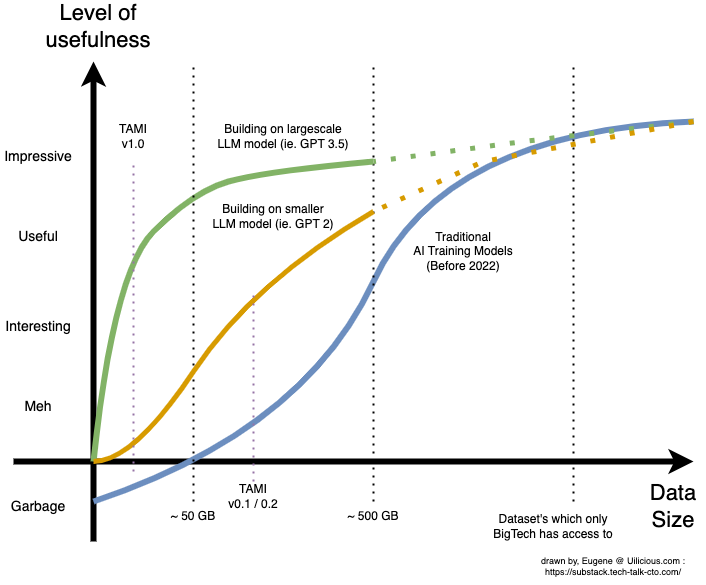

### Uilicious Case Study : Building our  AI - in under a week

The impact of this change with the latest GPT 3.5 models (which was used to build chatGPT), can be highlighted from our experience when we applied it for our use case at uilicious.com - A low-code UI test automation tool, with our new AI assistant : TAMI

You see - While we were big belivers in the long term future of AI,  we were also firm believers in only applying it in use cases where it makes the best fit or sense to our end users (and not just to appease investors). 

And because we knew that our UI testing dataset (for text) with only 50~100GB in size,  only made slightly better then garbage with traditional AI models in 2018.

We decided to take the approach of building the company at the start, to best suit the customers first (without AI), while building up our dataset for the eventual transition (with AI)

All while constantly doing small experiments, and waiting for the day our dataset and AI crossed the "useful" threshold. (GPT 2 for example, was interesting, but found to be barely useful with our dataset)



But then came GPT3.5, or chatGPT as the internet sees it now in the past month (Dec 2022). With the biggest implications being in the technical details on how the model was trained, and fine-tuned.

Which was a drastic and shocking moment. Because what we found, that despite converting only a small "<1GB" dataset of our entire "~100GB" dataset.

We had already crossed the "useful threshold", where the AI can start being used by our users and was outperforming everything we had previously.

While further experiments in increasing our dataset, showed diminishing returns. The key take away was how small of a dataset was required, to "make a useful product".

It literally took us less time to build a proof-of-concept AI using data for our priopriatry use case, then it took me to write this article.

---

## Notes that didn't fit in

In the AI / ML industry, the ability for a LLM to quickly learn new concepts and apply them is quantified and measured by tests called "Zero-Shot", "One-Shot" and "Few-Shot" learnings.

Generally the better the AI does in these test, the less data you need to train it for your use case.

> In my oppinion: This make sense in hindsight - who would have thought then a Neural Network modeled after humans, would like humans benefit from the T-Shape education model. Where a large breadth of generalised knowledge, help improve ones ability to learn specialised knowledge in one are of expertise. (this statement is not backed by any data)

swyx also does an excellent job in trying to consolidate various information, in this rapidly chaotic and growing space
- The Day The AGI Was Born: https://lspace.swyx.io/p/everything-we-know-about-chatgpt
- How Open Source is eating AI: https://lspace.swyx.io/p/open-source-ai
- His live AI notes: https://github.com/sw-yx/ai-notes/blob/main/TEXT.md#chatgpt

## Sources and citations

- GPT-3 45TB training set: https://www.springboard.com/blog/data-science/machine-learning-gpt-3-open-ai/
- GPT-3 estimated $4 million++ plus training cost: https://lambdalabs.com/blog/demystifying-gpt-3
- Bloom AI, an opensource competitor $1.6 million training cost: https://techcrunch.com/2022/07/12/a-year-in-the-making-bigsciences-ai-language-model-is-finally-available/
- T-Shaped model of education and work 
	- https://wordspy.com/index.php?word=t-shaped
	- https://collegeinfogeek.com/become-t-shaped-person/
- Large language models papers, for zero and few shot learnings
	- https://arxiv.org/abs/2205.11916 (zero shot)
	- https://arxiv.org/abs/2005.14165 (few shot)
- Call center salary rates in US : https://www.comparably.com/salaries/salaries-for-call-center-agent
- Average email sent by an office worker a day: https://www.templafy.com/blog/how-many-emails-are-sent-every-day-top-email-statistics-your-business-needs-to-know/
- Unsplash photo links
	- https://unsplash.com/photos/7swaW1bYpWI
	- https://unsplash.com/photos/1iVKwElWrPA
	- https://unsplash.com/photos/SELXIJwN24s
	- https://unsplash.com/photos/3xwrg7Vv6Ts


### Discarded draftings


So lets run through each major category, (one day, one week, one month) intern, including the rough how one would build them, and use them.

---

### The one day intern ... with prompt engineering

> **Positives**
> - Extreamly fast and easy to setup
> - Easy to expriment, anything you can get chatGPT to do, can be converted into this
> - You do not need to actually train it
> - Is useful enough in most creative writing applications, copywriting, etc
> - Or in helping with simple task
> 
> **Negatives**
> - You can only provide a small dataset 
>   (you are limited to approximately 4000 words, including the actual question and answer)
> - Its the least accurate approach due to the small dataset
> - Like an intern, with very limited training, things might start when the question is too far off from the intended dataset

Training in this category, is pretty much 1 sentence, or 1 quick paragraph. Before being thrown into the job ( these are arguably 1 day part time jobs disguised as internships ).

And is the fastest way to get AI to work with your product

You would outline a general set of instructions. And perhaps give a handful of examples. And is the easiest of all AI to train. 

Because you do not need to, you just need to add it as part of the question everytime.

All you need is to give the same set of instructions, which you would use at the start of every task session, before your intended user inputs. Something like the following ...

```
Decide whether a Tweet's sentiment is positive, neutral, or negative. Like the following, for example.

Tweet: "I loved the new Batman movie!" 
Sentiment: positive

Tweet: "The food was ok"
Sentiment: neutral

Tweet: "That was terrible"
Sentiment: negative
```

This can then be added with the actual question

```
Please evaluate the subsequent tweets

Tweet: "<<< Insert the text you want to evaluate here >>>"
Sentiment: 
```

Which the AI would then be able to respond, with the appropriate result. (positive/neutral/negative)

This technique is called "prompt engineering", or "prefix tuning". And if you are able to get chatGPT to be useful in anyway using a set of prefix. It pretty much is the same thing.

The limitations are also clear, just as how you do not expect an intern with such limited training to handle every scenerio - neither can you expect the AI to do the same.

For the areas of creative idea generation, or simple actions along the lines of "Amazon Mechanical Turk", this is probably sufficent.

For slightly more complex task, like help desk support, you will start facing problems by the limitaions of its training using this method (approximately 2000 words, give and take)

---

### The one month intern... with a formal training plan
