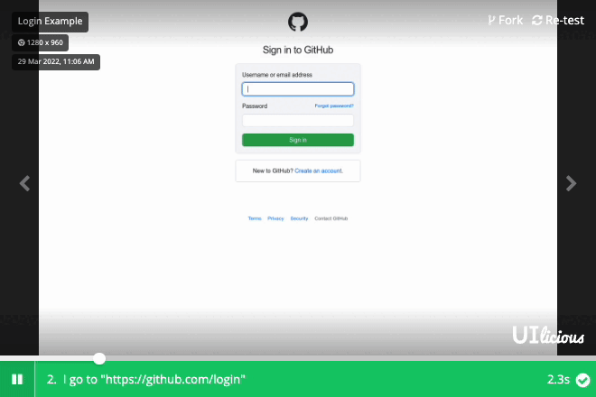

## Shameless plug: How can Uilicious.com automate cross browser testing, to make my website development more "Satisfactory"

Is manually testing your websites, prior to production deployment a huge time sink and pain?
Find existing website testing tools too complicated for your team to use?

Give [uilicious.com](https://uilicious.com) a try today, with our easy to use testing commands, which anyone, even manual testers can easily learn.

An example would be the following code snippet for a simple login test

```
// 🌐 Lets load up the website
I.goTo("https://github.com/login")

// 📝 Lets fill up the form
I.fill("Email", "john@example.com")
I.fill("Password", "supersecretpassword")

// 👉 Lets click on Sign in
I.click("Sign in")

// ⚠️ and properly check for the error
I.see("Incorrect username or password.")
```

Which would provide the following test results

[](https://snippet.uilicious.com/test/public/5994LUfLZKidFGJGiTxUyG)

Making testing websites on the internet quick and easy.

~ Eugene Cheah
  CTO / founder of Uilicious.com 